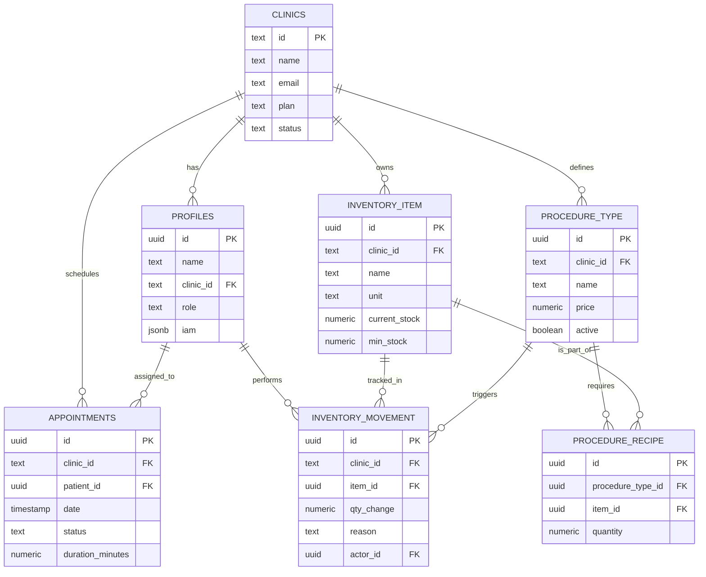

# 🗄️ IntraClinica: Diagrama de Entidade-Relacionamento (ER)

Este diagrama representa a estrutura de dados atual do **IntraClinica**, focada no isolamento por clínica (Multi-tenancy) e no controle de inventário.

---
*Diagrama gerado automaticamente para visualização técnica via Axio Nexus v3.* 🧪🏥
