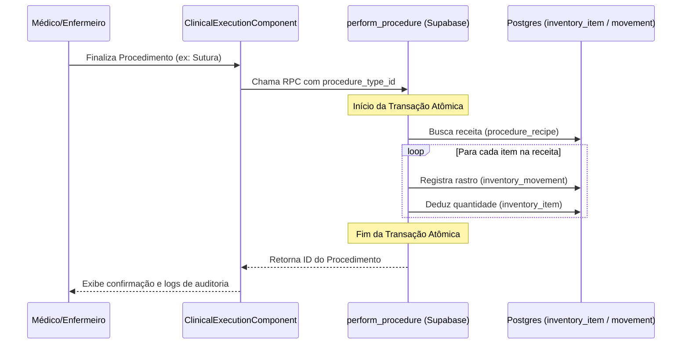
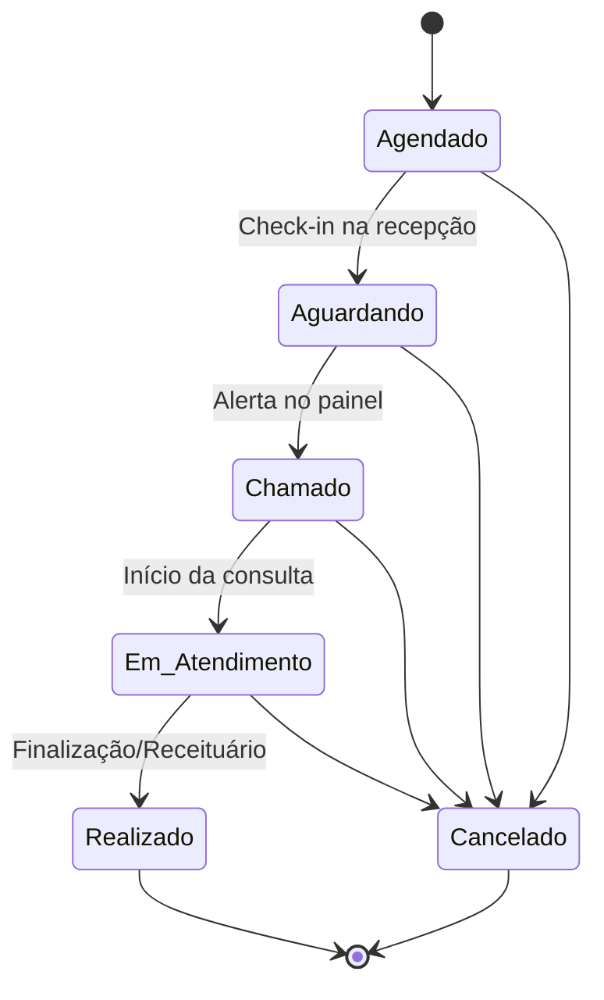

# ⚙️ IntraClinica: Diagramas UML e Fluxos de Lógica

Este documento detalha o comportamento dos principais processos de negócio do sistema.

## 1. Fluxo de Baixa de Estoque Automática (`perform_procedure`)
Este diagrama de sequência mostra como o sistema garante a integridade do estoque ao registrar um ato médico.

## 2. Máquina de Estados de Agendamento
Regras de transição para o status das consultas.

---
*Visualização técnica gerada pela arquitetura Axio Nexus v3.* 🧪🏥
