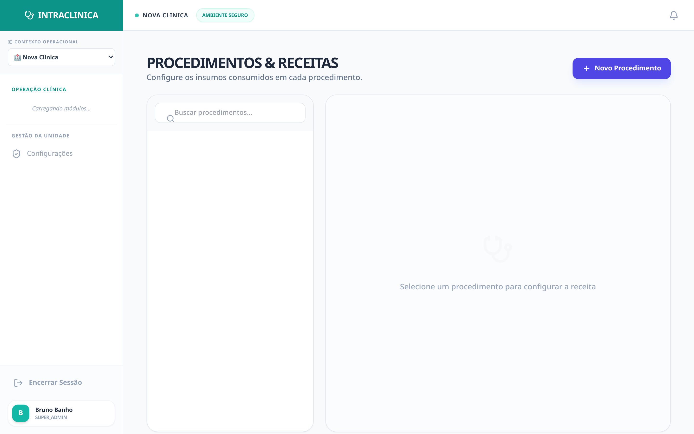

# Caso Crítico 02: A Ruptura Oculta de Insumos (Alto Custo)

Procedimentos de estética (Botox, Ácidos, Fios PDO) ou odontologia (Implantes) possuem insumos com altíssimo valor agregado (R$ 800 - R$ 2.000 a ampola) e vencimentos rígidos. Faltar produto na hora H é inaceitável.

---

### 🌪️ O Cenário (O Prejuízo)
A paciente está sentada na cadeira da clínica dermatológica. O médico abre a gaveta e percebe que a última seringa de *Ácido Hialurônico (Juvederm)* venceu semana passada ou já foi usada. O constrangimento é imediato, a venda é perdida, o paciente fica furioso e o estoque "de papel" (ou Excel) falhou em avisar o gestor. 

### ⚙️ Passo 1: A Configuração da 'Receita' (Procedimentos)
No IntraClinica, o *Estoque* nunca é uma "tabela isolada". Ele conversa em tempo real com os *Procedimentos*.
A clínica cadastra os Procedimentos como "Kits" (Receitas).

*(Note que o Procedimento de Harmonização tem atrelado a ele o Ácido Hialurônico e Anestésico).*

### ⚙️ Passo 2: A Baixa Automática no Prontuário
Durante a consulta, o médico não sai do seu fluxo. Ao finalizar o atendimento no **Prontuário Eletrônico**, ele apenas assinala que a "Harmonização Facial" foi **Realizada**.

*(Visão da Execução Clínica onde o procedimento é finalizado e o faturamento é gerado).*

Neste momento, o sistema entra no almoxarifado em milissegundos e **desconta os itens exatos** utilizando o método FIFO (Primeiro que Vence, Primeiro que Sai).

### 🧠 Passo 3: A Mágica Preditiva do NEXUS
O IntraClinica não espera o produto acabar para piscar o alerta na tela do gestor. Ele age hoje olhando para a semana que vem.

*(Painel de Estoque: As tarjas vermelhas sinalizam ruptura. Toxina Botulínica e Fios de PDO estão "zerados", sinalizando urgência de compra).*

1. **Previsão de Demanda:** A IA do NEXUS lê a agenda inteira dos médicos da clínica para os **próximos 15 dias**.
2. **Cálculo de Consumo Futuro:** Se a IA constata que existem **10 aplicações de Toxina agendadas**, mas o estoque atual é de **8 frascos**, o sistema acende o Alerta Crítico (vermelho na tela acima).
3. **Notificação Ativa:** O painel do Administrador dispara o aviso: *"Risco de ruptura: Faltarão 2 frascos para a agenda da semana que vem."*

### 📈 O Resultado Operacional
A clínica implanta o conceito de **Just-in-Time**. O gestor não precisa manter R$ 50.000,00 de capital de giro "preso" e nunca mais um paciente será despachado por falta de material.
