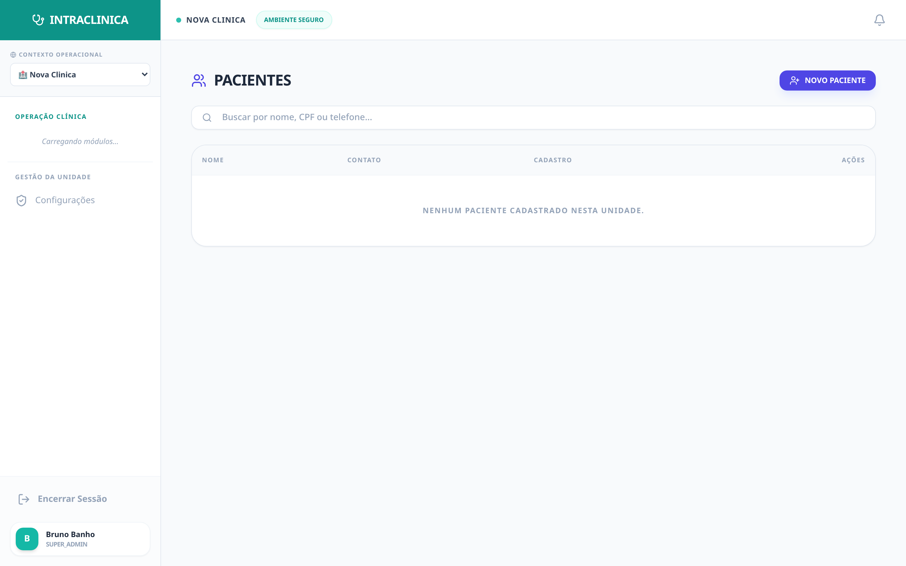
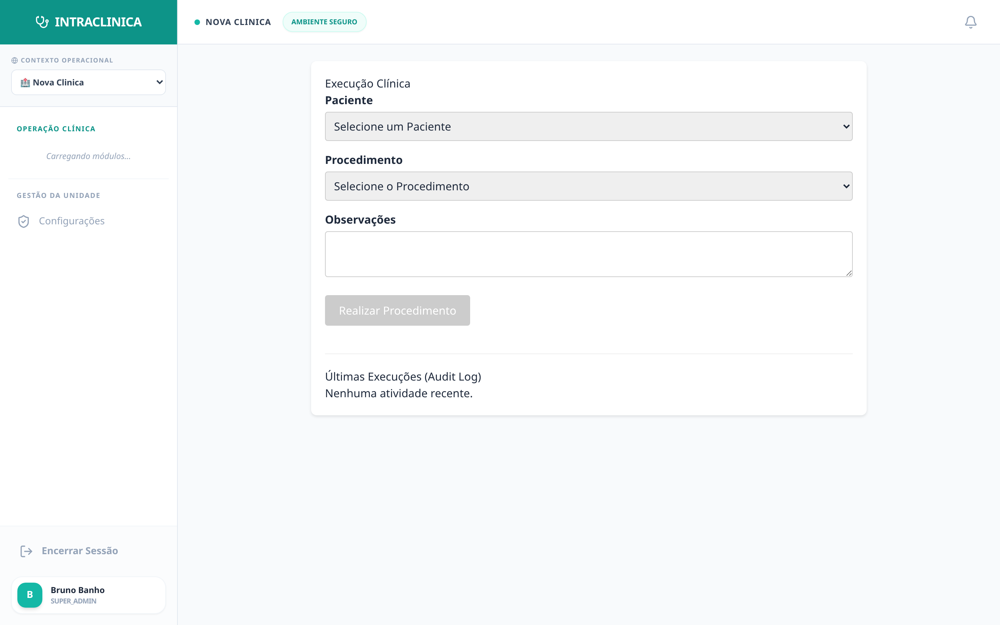

# Caso Crítico 03: Prontuário Complexo vs. Tempo Curto (A Cura da Burocracia)

A relação médico-paciente é o ativo mais valioso de uma clínica. Quando o médico passa a consulta inteira olhando para o teclado e digitando históricos, o paciente se sente ignorado. 

---

### 🌪️ O Cenário (A Burocracia)
Entra um paciente idoso na sala de atendimento.

*(O paciente possui um longo histórico na base da clínica).*

Com um histórico de 4 anos na clínica e 12 consultas anteriores, o médico não tem tempo físico para ler o histórico completo nos 15 minutos alocados. Ele acaba fazendo perguntas repetidas ("O senhor tem alergia a algum remédio mesmo?"), quebrando o *rapport* (conexão) e perdendo minutos preciosos.

### ⚙️ Passo 1: O Fim da "Busca nas Pastas Antigas"
O módulo *Clinical* (Prontuário) do IntraClinica não é um "Word online". É uma ferramenta de inteligência médica.

*(Visão da Execução Clínica).*

**O Resumo NEXUS Instantâneo:** Antes do paciente entrar, o médico aperta um único botão: "Resumo Nexus". A IA varre os 4 anos de prontuários, exames e receitas antigas em milissegundos e gera um parágrafo de 4 linhas:
   > *"Paciente idoso, hipertenso, **alérgico a dipirona**. Última consulta (há 3 meses) ajustou a dose de Losartana. Queixa crônica de dor lombar irradiada. Atenção para a pressão arterial hoje."*

### ⚙️ Passo 2: O Fim da Digitação (Evolução por Áudio)
O médico atende o paciente olhando nos olhos. Não toca no teclado.
Ao final da consulta, ele clica no microfone da plataforma e dita um fluxo de consciência bagunçado:
   > *"O seu Carlos voltou hoje. A dor lombar piorou ao deitar, ele lembrou que é alérgico a dipirona, prescrevi relaxante muscular à noite e marquei uma ressonância urgente."*

### 🧠 Passo 3: A Mágica do NEXUS (Padrão SOAP Médico-Legal)
O motor IA (conectado ao Google Gemini) processa o áudio cru. Ele não faz uma simples transcrição — ele tem conhecimento estrutural e médico embarcado:
*   Ele **formata a anamnese no padrão oficial SOAP** (Subjetivo, Objetivo, Avaliação, Plano).
*   Ele **extrai e tagueia a alergia** "alérgico a dipirona", criando um Alerta Vermelho de Segurança na capa do paciente para as próximas consultas.
*   Gera o documento final com assinatura imutável (*timestamp* no Supabase).

### 📈 O Resultado Operacional
Em 10 segundos, o médico tem um prontuário médico-legal perfeito. O paciente sai encantado com a atenção ininterrupta e humanizada, aumentando drasticamente a taxa de indicação boca-a-boca.
