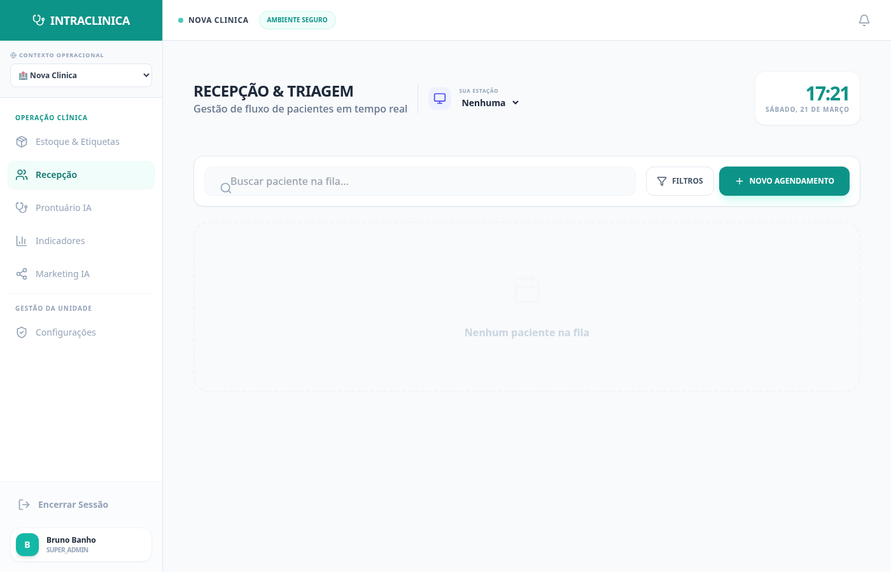
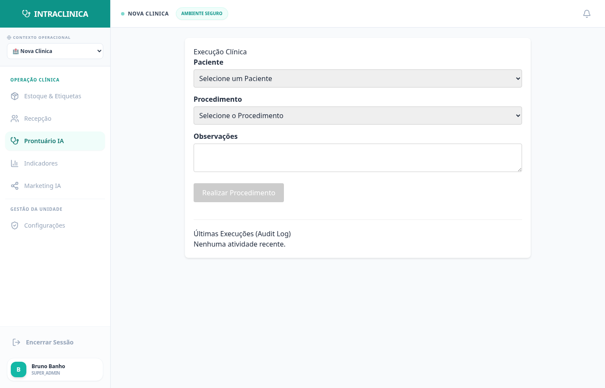
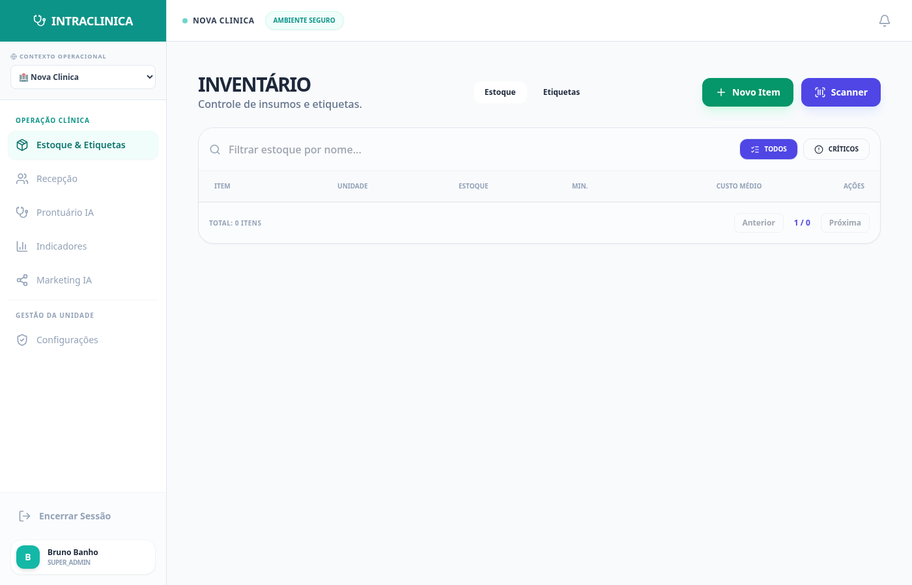
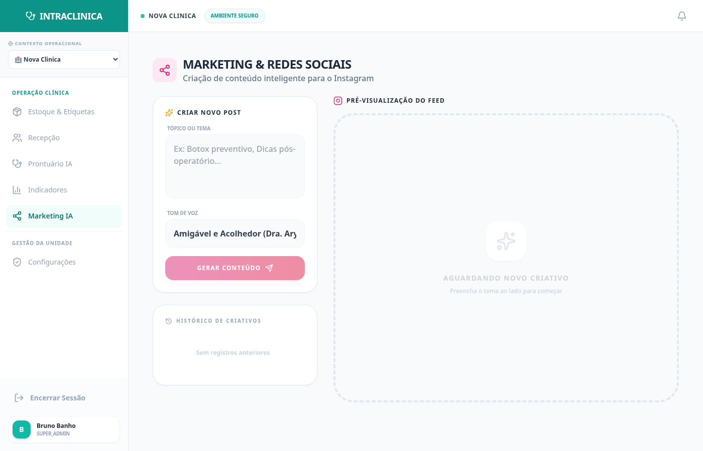
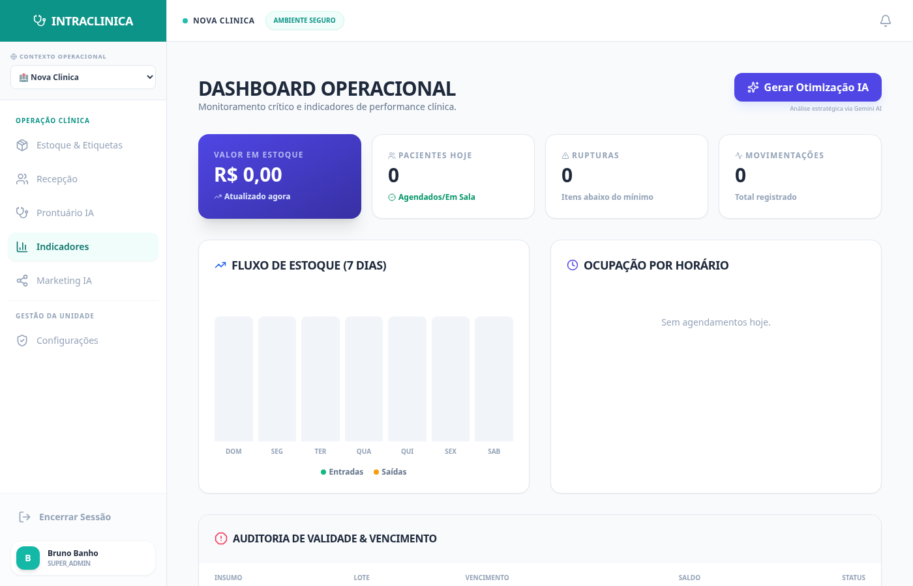

# O Sistema na Prática: Casos de Uso (Para Clínicas e Consultórios)

A rotina de uma clínica não tem espaço para cliques desnecessários. O **IntraClinica** foi construído ao redor dos gargalos reais da operação médica.

Abaixo, veja como os principais módulos do ecossistema resolvem os problemas da sua equipe no dia a dia.

---

## 1. O Caos da Recepção e Tempos de Espera
**O Problema:** Pacientes chegam, a sala de espera enche, o médico não sabe quem já chegou, e a recepcionista perde tempo gritando nomes.

**A Solução (IntraClinica):**
O módulo de Recepção é um painel de controle linear (Kanban clínico).

*   **Status Visual Instantâneo:** As cores ditam o fluxo.
    *   Cinza: **Agendado** (Paciente ainda não chegou).
    *   Amarelo: **Aguardando** (Check-in feito na recepção).
    *   Roxo: **Chamado** (Médico apertou o botão no consultório).
    *   Verde: **Realizado** (Finalizado e faturado).
*   **Ação Rápida:** Com um clique, a recepcionista muda o status para "Aguardando" e o nome do paciente pisca na tela do médico dentro do consultório.

---

## 2. Prontuários Lentos e Burocráticos
**O Problema:** O médico gasta mais tempo digitando a evolução do paciente do que olhando nos olhos dele.

**A Solução (IntraClinica):**
O módulo Clínico traz o Prontuário Eletrônico potencializado por Inteligência Artificial.

*   **Evolução via Áudio/Ditado Curto:** Em vez de digitar, o médico joga palavras-chave soltas: *"paciente com dor de cabeça 3 dias febre leve sinusite prescrevo ibuprofeno"*.
*   **Formatação IA (Padrão SOAP):** Com um clique, a IA nativa do sistema transforma suas anotações corridas em uma Evolução Clínica formal, organizada e estruturada.
*   **Segurança Criptografada:** Todo registro gera um *timestamp* inalterável com a assinatura do profissional, protegendo a clínica juridicamente.

---

## 3. Furo de Estoque e Dinheiro Perdido
**O Problema:** A clínica faz procedimentos estéticos (Botox, Ácido Hialurônico) ou pequenas cirurgias, mas o controle das seringas, gazes e ampolas é feito em planilhas ou papel. O estoque fura, os produtos vencem e a clínica perde dinheiro.

**A Solução (IntraClinica):**
O Controle de Insumos é integrado automaticamente aos Procedimentos.

*   **Receitas de Procedimento:** Você cadastra um kit (Ex: "Limpeza de Pele" = 1 Máscara + 2 Pares de Luva + 1 Soro).
*   **Baixa Automática:** Quando o médico marca o procedimento como "Realizado" no prontuário, o sistema **desconta automaticamente** os itens do almoxarifado.
*   **Alertas de Ruptura:** O dashboard pisca vermelho quando um produto de alto custo (como preenchedores) atinge o "Estoque Mínimo".

---

## 4. "Não tenho tempo para Marketing"
**O Problema:** Clínicas precisam produzir conteúdo para o Instagram e LinkedIn para atrair pacientes particulares, mas os profissionais não têm tempo nem criatividade para escrever roteiros.

**A Solução (IntraClinica):**
Um módulo dedicado de Marketing Médico IA.

*   **Geração em Segundos:** Digite o tema desejado (ex: *"A importância do protetor solar no inverno"*).
*   **Tom de Voz:** Escolha se o texto deve ser "Amigável (Acolhedor)", "Técnico (Profissional)" ou "Alerta (Urgente)".
*   **Pronto para Postar:** O sistema gera o texto completo, já com gatilhos mentais, quebras de linha ideais e as melhores hashtags para o algoritmo da rede social escolhida.

---

## 5. Tomada de Decisão no Escuro
**O Problema:** O gestor da clínica não sabe qual o dia da semana com mais faltas (no-shows) ou qual procedimento traz mais margem, pois os dados estão espalhados.

**A Solução (IntraClinica):**
Um Dashboard Analítico Executivo.

*   **Visão em Tempo Real:** Volume de consultas, faturamento e produtividade da equipe atualizados a cada segundo.
*   **Insight IA (Conselheiro Virtual):** Um botão que lê os dados do mês atual e cospe um parágrafo executivo: *"Notamos um aumento de 15% nos cancelamentos às sextas-feiras. Sugerimos ativar lembretes de WhatsApp automáticos nas quintas."*

---

*IntraClinica — Mais medicina, menos burocracia.*
