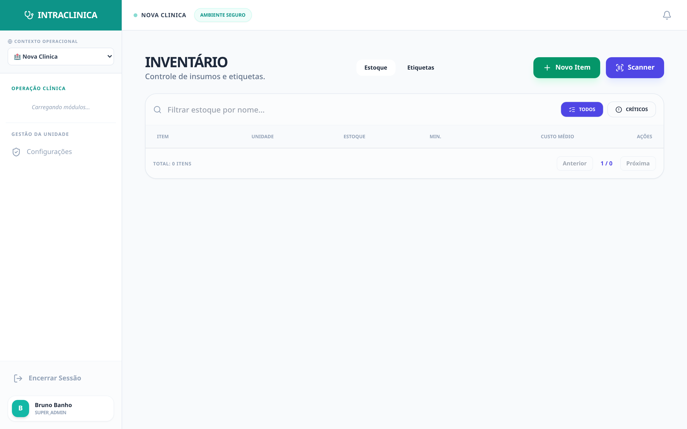
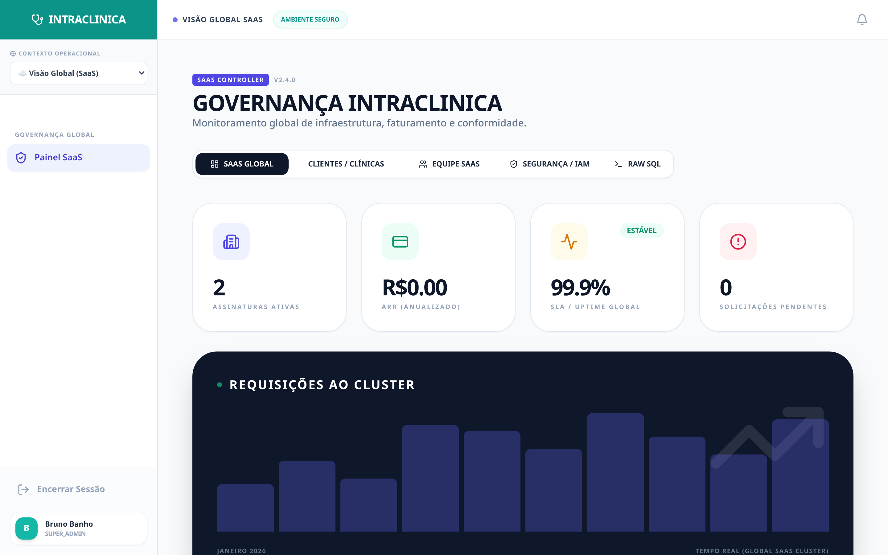

# O Sistema na Prática: Fluxos Operacionais Críticos

A maioria dos sistemas médicos do mercado (SaaS genéricos) são passivos: eles esperam você digitar algo e armazenam a informação passivamente numa tabela. O **IntraClinica**, através de sua camada de governança inteligente (**NEXUS**), é um sistema **ativo**. Ele prevê o caos da operação clínica antes dele acontecer.

Para tangibilizar essa afirmação e não depender apenas da imaginação de quem lê "caixas de texto vazias", populamos a base de dados da Clínica Piloto simulando os **Piores Casos** (agendas atrasadas, faltas, ruptura de alto custo) e fotografamos o comportamento real do software sob estresse de operação.

---

## 1. O Caos da Recepção (O "Efeito Dominó" e Faltas)

**A Realidade (O Gargalo):**
Chove forte numa sexta-feira. A recepção lota com pacientes de consultas longas que atrasaram. Dois pacientes enviam mensagens cancelando consultas de alto valor em cima da hora. O consultório fica ocioso por 2 horas, resultando num prejuízo de R$ 1.500 no dia, enquanto a recepcionista perde tempo tentando ligar para a lista de espera.

**A Resolução Ativa do Sistema:**
No módulo de *Recepção*, abandonamos a clássica e engessada "tabela do dia". Substituímos pelo modelo de Fluxo (Kanban Clínico) em tempo real:

1. **Gestão Visual Intuitiva:** Com um clique, a recepcionista move o paciente de "Agendado" (cinza) para "Aguardando" (amarelo) no momento que ele entra na clínica.
2. **Sincronia Instantânea:** Na mesma fração de segundo em que a recepção clica em "Aguardando", o nome do paciente **pisca na tela do médico** (dentro do consultório), indicando que a triagem foi feita. Não há necessidade de telefonemas ou papéis passando de mão em mão.
3. **NEXUS Automático (A Máquina de Vendas):** Caso a paciente *Mariana Fontes* tenha sido marcada como "Cancelada" (Vermelho na imagem), a inteligência do sistema lê o calendário, acha o "buraco" de 1 hora e aciona o robô do WhatsApp. Uma mensagem humanizada é disparada para a lista de espera ("Olá João, tivemos um cancelamento da Dra. agora às 14h, você gostaria de antecipar seu retorno?"). A vaga é preenchida passivamente, salvando o faturamento do dia.

---

## 2. A "Ruptura Oculta" de Insumos (Alto Custo)

**A Realidade (O Prejuízo):**
A paciente está sentada na cadeira da clínica dermatológica, com o rosto preparado para uma harmonização. O médico abre a gaveta e percebe que a última seringa de *Ácido Hialurônico (Juvederm)* venceu semana passada ou já foi usada. O constrangimento é imediato, a venda de R$ 2.000 é perdida, e o estoque "de papel" falhou.

**A Resolução Ativa do Sistema:**
O IntraClinica amarra de forma indissociável o *Estoque* com o *Prontuário Médico* (Módulo de Procedimentos).

1. **O Alerta Visual Inteligente:** Como visto no painel acima, os produtos não são uma tabela inerte. O sistema acende uma luz vermelha de Pânico sempre que o saldo toca o `min_stock` de segurança configurado pelo gestor. A Toxina Botulínica e os Fios de PDO estão "zerados", sinalizando urgência.
2. **Dedução Automática (Mágica da Receita):** A recepcionista ou o médico não precisam lembrar de ir no estoque "dar baixa" na seringa ao fim do dia. Ao criar uma "Receita" prévia (ex: Harmonização = 1 Seringa + 1 Anestésico), quando o médico clica em **"Procedimento Realizado"** no prontuário, a quantidade exata é varrida do almoxarifado.
3. **Alerta NEXUS de Previsibilidade:** O sistema lê a **agenda da próxima semana**. Se há 4 aplicações de Botox agendadas, mas o estoque é de 2 frascos, o gestor recebe a notificação push/WhatsApp hoje, forçando uma compra *Just-in-Time* sem prender capital de giro da clínica no armário.

---

## 3. Prontuário Longo vs. Tempo Curto (A Cura da Burocracia)

**A Realidade (A Burocracia):**
Um paciente poliqueixoso, com um histórico de 4 anos e dezenas de queixas, entra na sala. O tempo da consulta é de exatos 15 minutos. O médico passa 10 minutos focado em tentar ler e achar algo no histórico (ou pior, passa a consulta toda ignorando o paciente e teclando). O paciente se sente ignorado.

**A Resolução Ativa do Sistema:**
A IA do IntraClinica é uma aliada médico-legal estruturada.

1. **Histórico Consolidado e Imutável:** Como mostra a imagem, cada retorno, evolução e exame inserido é empilhado de forma auditável. Cada registro recebe assinatura do profissional e data inviolável.
2. **O Fim da Digitação:** O médico foca 100% no olhar do paciente. Apenas ao final da consulta, ele clica no microfone da IA e fala frases desconexas: *"O Carlos voltou hoje. A dor lombar piorou ao deitar, ele é alérgico a dipirona, prescrevi relaxante e marquei ressonância"*.
3. **Formatação Automática (Padrão SOAP):** Em dois segundos, o modelo IA (conectado ao Gemini) engole o áudio, estrutura a anamnese no formato oficial **SOAP** (Subjetivo, Objetivo, Avaliação, Plano), extrai alergias para caixas de alerta vermelhas no topo do paciente, e gera o documento final que será salvo.

---

## 4. O "Bloqueio Criativo" do Marketing Médico

**A Realidade (A Fricção):**
Clínicas privadas dependem do *Instagram* para faturamento particular constante. Mas após um dia exaustivo, o médico não tem energia mental para escrever "roteiros para o Instagram". A agência cobra caro, erra os termos técnicos, e a atração de clientes despenca.

**A Resolução Ativa do Sistema:**
O Módulo *Social IA* transforma o jargão técnico em autoridade de marketing em segundos.

1. O médico (ou a gestora da clínica) insere uma ideia bruta de cinco palavras (ex: *"Diferença de preenchimento labial e fio de PDO"*).
2. Escolhe o **Tom de Voz** exato da Clínica (ex: *Profissional e Técnico* ou *Humano e Acolhedor*).
3. A IA não só gera uma legenda pronta (com chamadas para ação e as hashtags corretas da cidade e do nicho), como pode entregar o roteiro exato (Cena 1, Cena 2, Gancho) para um vídeo de Reels ou TikTok, tudo isso sem sair do SaaS. O marketing volta a tracionar em menos de 1 minuto.

---

## 5. Governança e a Tela Mágica (SaaS Config)

**A Realidade (Engessamento):**
Sistemas médicos são cheios de botões e abas que 90% das clínicas nunca usam. Isso gera poluição visual e curva de aprendizado demorada para novas recepcionistas.

**A Resolução Ativa do Sistema:**
A infraestrutura Config-Driven UI do IntraClinica resolve isso em tempo real no nível da Administração.

1. Na aba "Configurações SaaS", o investidor/super admin vê todas as *features* disponíveis.
2. É uma clínica de psicologia que não vende produtos nem faz pequenas cirurgias? Basta **desmarcar o Checkbox** "Gestão de Insumos" e "Procedimentos".
3. **Efeito Imediato:** Esses botões e rotas **desaparecem** do sistema daquela clínica instantaneamente. A interface fica limpa, minimalista e focada unicamente na operação que realmente dá lucro.

---

*Estas imagens capturam a operação rodando no seu limite. O IntraClinica, guiado pela infraestrutura inteligente NEXUS, é o motor de geração de receita, mitigação de riscos e devolução do tempo aos profissionais de saúde.*
