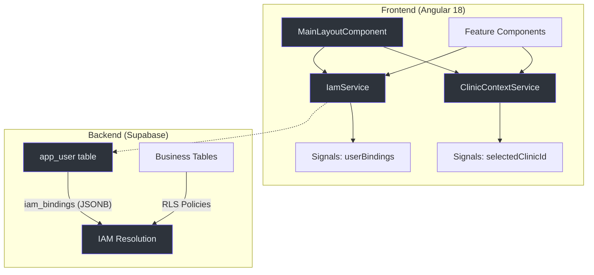
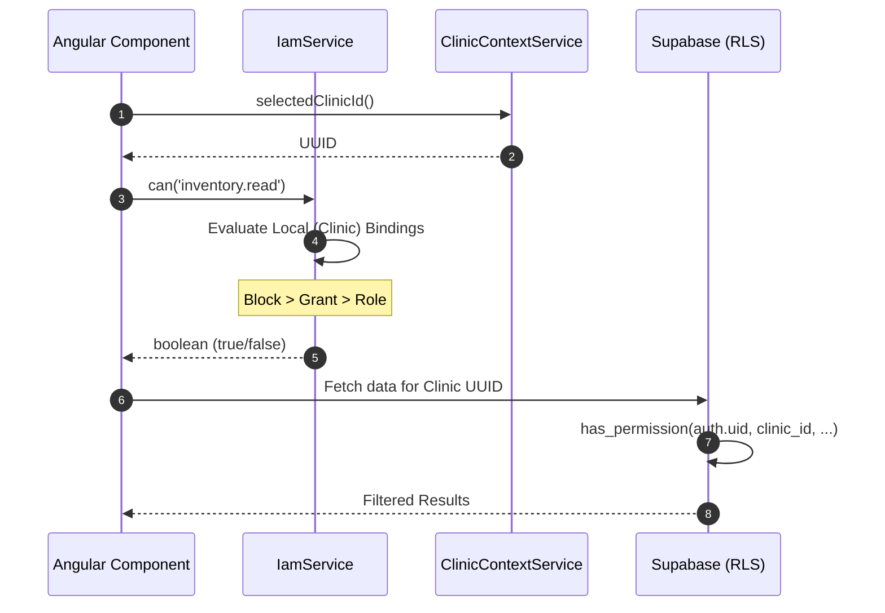

# Operational Map & Cold-Boot Guide

This document serves as the primary technical entry point for developers and autonomous agents working on the **IntraClinica** repository. It outlines the modern architecture, the IAM security model, and the critical migration gaps from the legacy system.

## 1. High-Level Architecture

IntraClinica is a multi-tenant SaaS application built on a decoupled architecture.

### 1.1 Tech Stack
- **Frontend**: Angular 18+ (Standalone, Signals, Tailwind CSS).
- **Backend**: Supabase (PostgreSQL + RLS + GoTrue Auth).
- **AI**: Gemini (Cloud) and WebLLM/TensorFlow.js (Local).

### 1.2 Frontend Structure (FSD-like)
The frontend code is located in `/frontend/src/app/` and follows a feature-based organization (`frontend/src/app/features/`).

## 2. Security & IAM Model

The security model is **GCP-Style**, where permissions are resolved through a hierarchy of Roles, explicit Grants, and explicit Blocks (file: `frontend/src/app/core/services/iam.service.ts:84`).

### 2.1 The Resolution Funnel
1. **Explicit Blocks**: Absolute priority. If a block exists for a clinic, access is denied.
2. **Explicit Grants**: Direct permission assignment.
3. **Roles**: Collection of default grants (e.g., `roles/doctor`).
4. **Global Fallback**: If not resolved at the clinic level, check the `global` node in `iam_bindings`.

### 2.2 Multi-Tenancy (Row Level Security)
Cross-tenant leaks are prevented at the database level using PostgreSQL RLS policies tied to the `app_user.iam_bindings` JSONB column.

## 3. Core Operational Components

| Component / Service | Responsibility | Key Reference |
| :--- | :--- | :--- |
| `ClinicContextService` | Global state for the active clinic ID. | `core/services/clinic-context.service.ts:8` |
| `IamService` | In-memory evaluation of security policies. | `core/services/iam.service.ts:10` |
| `MainLayoutComponent` | Orchestrates Sidebar, Context Switcher, and Layout. | `layout/main-layout.component.ts:232` |
| `SupabaseService` | Centralized Supabase client instance. | `core/services/supabase.service.ts:8` |
| `authGuard` | Protects routes using `auth.getSession()`. | `core/guards/auth.guard.ts:5` |

## 4. Legacy Migration Gaps (CRITICAL)

The following features from the legacy system are currently missing or exist only as skeletons in the new version.

### 4.1 Missing Clinical Operations
- **Procedures & Recipes**: The logic to debit stock during a procedure and generate medical recipes.
- **Consultation Execution**: "Start" and "Finish" consultation flows with status updates.
- **Audio/AI Refinement**: Voice-to-prontuário formatting via local/cloud AI.

### 4.2 Marketing & Social
- **Gemini Marketing**: AI-powered social media post generator for clinics.

### 4.3 Technical Debt: The Store Layer
Currently, components often interact directly with services. The intended architecture requires a **Store** layer (`core/store/`) to act as a signal-based facade over services, ensuring better state sharing across features (file: `AGENTS.md:51`).

## 5. Development Workflow

1. **Inside `/frontend`**: All work must be done here.
2. **Signals Only**: No assignment of signals to static variables in constructors.
3. **Validation**: Run `tsc --noEmit` before any commit.
4. **IAM Enforcement**: Always wrap protected UI elements with `@if (iam.can('...'))` (file: `layout/main-layout.component.ts:68`).

## 6. References
- Architectural rules: `AGENTS.md`
- Database schema and RLS: `wiki-site/docs/core-architecture/database.md`
- Detailed IAM specs: `wiki-site/docs/core-architecture/iam-security-model.md`
- Legacy action map: `wiki-site/docs/raw-reports/legacy-frontend-actions.md`
