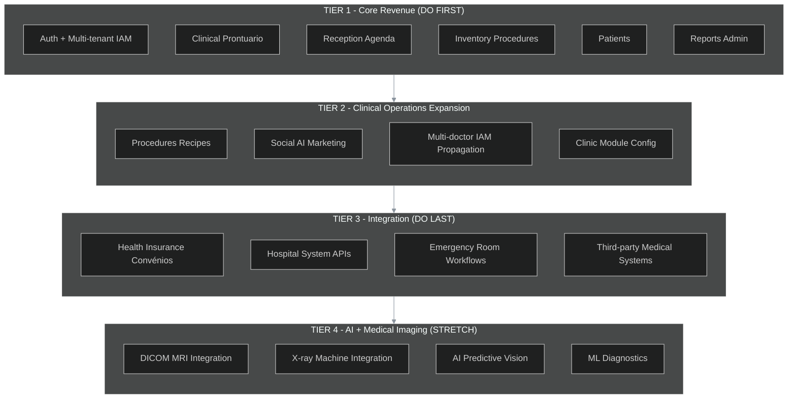
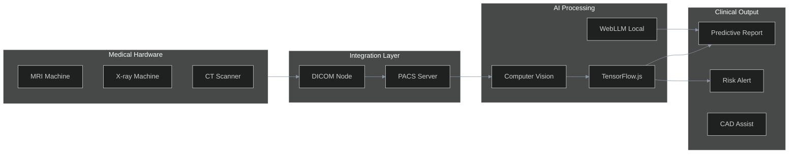
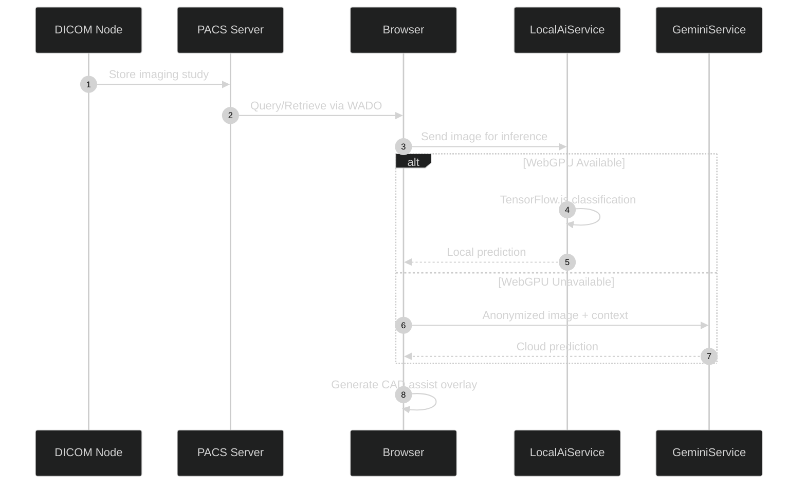
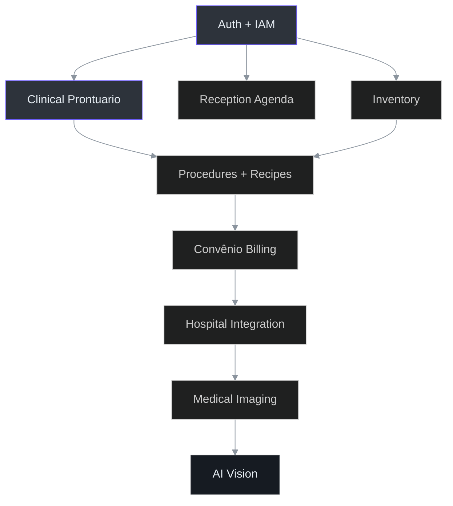

# IntraClinica Product Vision

**Version:** 1.0  
**Date:** March 23, 2026  
**Status:** Living Document

---

## 1. Strategic Thesis: The Sovereign Clinical Experience

IntraClinica is not a generic clinic management system. Our thesis is the **Sovereign Clinical Experience** — technology that disappears into the workflow, letting doctors focus on patients while maintaining absolute data sovereignty and privacy.

The system must be sufficient to organize medical clinics of **all specialties**, but we deliberately defer complex insurance (convênio) integrations and hospital system connections until we achieve product-market fit in Tier 1-2. Our stretch goal is integration with medical imaging hardware (MRI, X-ray) and AI predictive computer vision.

---

## 2. Four-Tier Product Roadmap



---

## 3. Feature Parity Matrix

| Feature | Current State | Tier 1 Target | Full Vision |
|---------|---------------|---------------|-------------|
| **Auth / Login** | Supabase Auth working, login form implemented (`login.component.ts:136`) | Multi-tenant MFA, SSO | OAuth2 + SAML for hospital networks |
| **Multi-tenant IAM** | `iam_bindings` JSONB working, RLS enforced (`database.md:109`) | Role-based UI hiding, granular permissions | Cross-clinic federation |
| **Clinical Prontuário** | `clinical_record` table, RPC `create_medical_record` (`clinical.service.ts:39`) | Full EVOLUCAO/RECEITA/EXAME/TRIAGEM types | Multimedia records, voice-to-text |
| **Reception Agenda** | `appointment.service.ts`, basic calendar UI | Smart scheduling, no-show prediction | Multi-location coordination |
| **Inventory + Procedures** | `product` table, `create_product_with_stock` RPC (`inventory.service.ts:53`) | Procedure-linked consumption | Supplier integration, predictive restock |
| **Patients** | `patient` table with flattened schema (`database.md:17`) | Full patient history timeline | CRM with marketing automation |
| **Reports / Admin** | Basic component structure (`admin-panel.component.ts`) | Multi-clinic analytics dashboard | Business intelligence, benchmarking |
| **Procedures + Recipes** | Not started | Atomic RPC for procedure+dispense | Automated supply chain |
| **Social AI Marketing** | `GeminiService` exists (`ai-integrations.md:67`) | Content generation from clinical stories | Multi-channel campaign automation |
| **Multi-doctor Support** | Single doctor per clinic assumed | Full `app_user` role propagation | Network-wide instant messaging |
| **Clinic Module Config** | `clinic_module` table exists (`database.md:52`) | Feature toggles per clinic | White-label theming |
| **Convênio Management** | Not started | Insurance plan CRUD, billing | Real-time claim processing |
| **Hospital Integration** | Not started | HL7/FHIR gateway | Full interoperability |
| **Emergency Workflows** | Not started | Triage优先级算法 | ED tracking board |
| **DICOM / MRI** | Not started | DICOM node client | PACS integration |
| **AI Vision** | WebLLM/Gemini for text (`ai-integrations.md:36`) | Image classification | Predictive diagnostics |

### Progress Indicator

```
Tier 1: ████████░░ 80% (Core framework complete, needs polish)
Tier 2: █░░░░░░░░░ 10% (Module config table exists, rest not started)
Tier 3: ░░░░░░░░░░  0%
Tier 4: ░░░░░░░░░░  0%
```

---

## 4. Technical Requirements by Tier

### Tier 1: Core Revenue

| Requirement | Technology | Priority |
|-------------|------------|----------|
| Supabase Auth hardening | Row Level Security, multi-tenant RLS policies | Critical |
| Clinical record RPC | PostgreSQL functions for atomicity (`create_medical_record`) | Critical |
| Inventory atomic operations | `create_product_with_stock` RPC already exists | High |
| Appointment scheduling | Calendar component, conflict detection | High |
| Patient demographics | Flattened `patient` table with JSONB address | High |
| Basic reports | Aggregation queries on `clinical_record`, `appointment` | Medium |
| Clinic context switching | `ClinicContextService` with `selectedClinicId` signal | Critical |

### Tier 2: Clinical Operations Expansion

| Requirement | Technology | Priority |
|-------------|------------|----------|
| Procedure + recipe linkage | Extend `create_medical_record` to handle `dispense_items` | High |
| Social media AI | `GeminiService` content generation pipeline | Medium |
| Multi-doctor IAM | Propagate `iam_bindings` across clinic network | High |
| Feature flags per clinic | `clinic_module` + `ui_module` tables | Medium |

### Tier 3: Integration Layer

| Requirement | Technology | Notes |
|-------------|------------|-------|
| Convênio CRUD | New `insurance_plan`, `insurance_contract` tables | Complex billing rules deferred |
| HL7 FHIR gateway | Node.js middleware service | Hospital system interoperability |
| Emergency triage | Priority queue algorithm, real-time tracking | ED-specific workflows |
| Third-party APIs | REST/HL7 adapters | ла |
| Billing engine | Invoice generation, claim submission | Post-Tier 2 |

### Tier 4: AI + Medical Imaging



| Requirement | Technology | Notes |
|-------------|------------|-------|
| DICOM client | `dicom-parser` or `cornerstone.js` | Browser-based DICOM viewer |
| PACS connectivity | DICOM node / DCM4CHEE | On-premise or cloud PACS |
| X-ray integration | Standard DICOM worklist | CR/DR systems |
| AI model training | Transfer learning on medical datasets | Privacy-preserving federated learning |
| Computer vision | TensorFlow.js + WebLLM hybrid | Inference at edge |
| Predictive diagnostics | ML pipeline + explainability | LGPD/HIPAA compliance critical |

---

## 5. AI/ML Roadmap for Medical Imaging

### Phase 1: Foundation (Tier 1-2 complete)

- Expand `GeminiService` for medical image annotation requests
- Implement privacy-first local inference with WebLLM for sensitive reports
- Train models on anonymized clinical data

### Phase 2: DICOM Infrastructure (Tier 3 overlap)



### Phase 3: Predictive Vision (Tier 4 stretch)

| Use Case | AI Model | Data Source |
|----------|----------|-------------|
| Chest X-ray abnormality detection | CNN (ResNet/VGG variant) | NIH ChestX-ray14 |
| MRI brain lesion segmentation | U-Net variant | Private clinic data |
| Diabetic retinopathy screening | Transfer learning EfficientNet | Messidor-2 |
| Mammography CAD | Dual-view CNN | INbreast |

### Phase 4: Production Hardening

1. **Federated learning** for privacy-preserving model updates
2. **Explainability layer** (Grad-CAM, SHAP) for clinician trust
3. **Edge deployment** via WebLLM for offline capability
4. **Regulatory compliance** mapping (ANVISA, FDA, CE marking)

---

## 6. Architectural Dependencies



**Critical Path:** Auth → Clinical → Procedures → Convênio → Hospital → Imaging → AI

---

## 7. Multi-Tenant Security Model

All tiers must maintain the sovereign clinical experience security model:

```typescript
// From clinical.service.ts:31-36 - Clinic context guard
private get clinicId(): string {
  const id = this.context.selectedClinicId();
  if (!id || id === 'all') {
    throw new Error('Invalid Clinic Context');
  }
  return id;
}
```

| Tier | Security Requirement |
|------|---------------------|
| Tier 1 | RLS on all tables, `iam_bindings` enforcement |
| Tier 2 | Cross-clinic role propagation, feature-gated UI |
| Tier 3 | FHIR/HL7 authentication, insurance API OAuth |
| Tier 4 | DICOM authentication, audit logging for AI decisions |

---

## 8. Database Evolution Roadmap

| Phase | Migration | Purpose |
|-------|-----------|---------|
| Current | `20260323000000_flatten_actor_model.sql` | Flat schema complete |
| Tier 1 | Add `appointment` constraints, indexes | Performance |
| Tier 2 | Add `procedure_recipe` linking table | Clinical workflow |
| Tier 3 | Add `insurance_claim`, `hospital_encounter` tables | Integration |
| Tier 4 | Add `dicom_study`, `ai_prediction` tables | Imaging pipeline |

---

## 9. Open Questions

1. **Convênio billing complexity**: Brazil's insurance billing (TISS/SADT) is notoriously complex. When to tackle?
2. **DICOM storage**: Cloud PACS vs. on-premise? Cost vs. latency tradeoffs.
3. **AI model liability**: Who bears responsibility for AI-assisted diagnoses?
4. **Federated learning**: Technical complexity vs. privacy benefit ratio.

---

## Related Documentation

- [Executive Summary](../executive-summary) — Business context
- [AI Integrations](../core-architecture/ai-integrations) — Current AI architecture
- [Database Schema](../core-architecture/database) — Current schema
- [Multi-Tenant Security](../core-architecture/multi-tenant-security) — IAM/RLS details
- [Clinical Module](../feature-modules/clinical) — Tier 1 core feature
