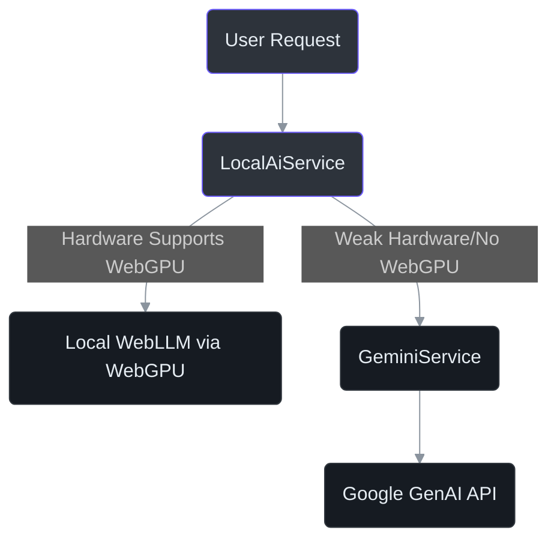
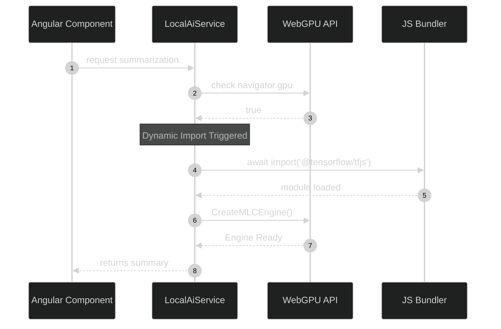

# AI Integrations

IntraClinica heavily utilizes AI for intelligent data processing, clinical record summarization, and user assistance. 

This document details the dual-pronged approach to AI integration, contrasting the local, privacy-first `LocalAiService` with the cloud-based `GeminiService` fallback.

## 1. The Dual AI Strategy

The application leverages two distinct AI providers depending on the user's hardware capabilities, internet connection, and the sensitivity of the data being processed.

### Why Dual Providers?

As dictated by `AGENTS.md:110`, we prioritize patient data privacy. For highly sensitive operations (e.g., parsing raw clinical notes), we attempt to use a local Large Language Model running directly in the browser. For less sensitive tasks or on weak devices, we fall back to a cloud provider.



## 2. LocalAiService (WebLLM & WebGPU)

The `LocalAiService` provides inference running entirely on the client's device, ensuring zero sensitive data leaves the browser. It utilizes `@mlc-ai/web-llm` and `@tensorflow/tfjs`.

### The Strict Lazy-Loading Rule

According to `AGENTS.md:113`, there is a critical rule regarding TensorFlow and WebGPU imports: **they must be dynamic**.

If you use top-level static imports (e.g., `import * as tf from '@tensorflow/tfjs'`), the JavaScript engine will execute the module load sequence immediately. On devices without GPUs or WebGL support, this will crash the application before the UI even renders.

### Correct Implementation

You must use dynamic imports inside the initialization function:

```typescript
// frontend/src/app/core/services/local-ai.service.ts
async initializeModel() {
  if (navigator.gpu) {
    const tf = await import('@tensorflow/tfjs');
    const { CreateMLCEngine } = await import('@mlc-ai/web-llm');
    // ...
  }
}
```



## 3. GeminiService (Cloud Fallback)

When the user's device lacks WebGPU support, or when the task requires a significantly larger parameter model, the application relies on the `GeminiService` which connects to the Google GenAI SDK (`AGENTS.md:118`).

### Graceful Degradation

Cloud APIs are subject to network failures, latency spikes, and quota limits. The `GeminiService` must handle these gracefully.

If the API call fails, the service must catch the error and provide a sensible fallback to the UI (e.g., returning the original text unmodified or a standard error message string) rather than crashing the component.
