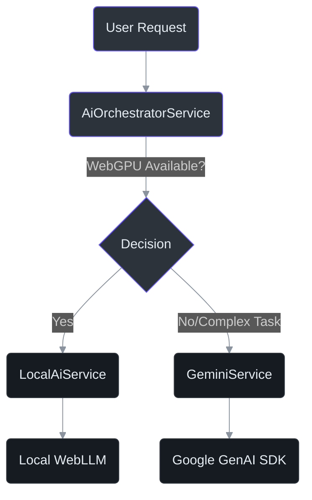
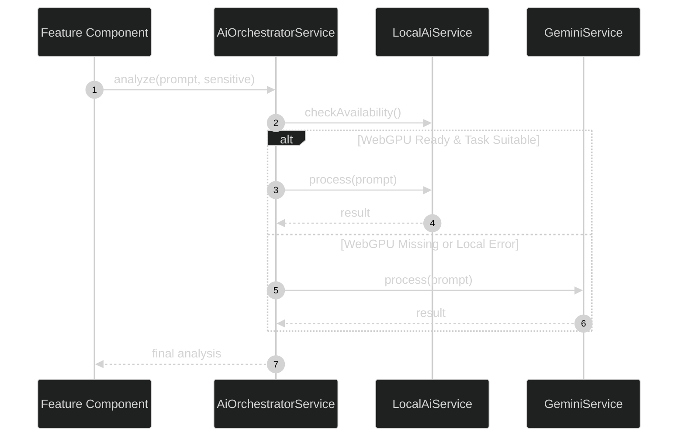

# AI Integrations

IntraClinica utilizes a dual AI strategy to balance patient privacy, processing power, and cost efficiency. This approach combines on-device Large Language Models (LLMs) with cloud-based intelligence.

## 1. The Dual AI Strategy

We prioritize local processing to ensure patient data remains on the user's device whenever possible. The system automatically routes requests based on hardware capabilities and task complexity.

- **Local First**: Clinical note parsing and sensitive patient data analysis are performed locally via WebLLM.
- **Cloud Fallback**: Complex reasoning, strategic insights, and social media content generation use the Gemini API.



## 2. LocalAiService (WebLLM & WebGPU)

The `LocalAiService` enables private, on-device inference using the `@mlc-ai/web-llm` and `@tensorflow/tfjs` libraries.

### Dynamic Import Pattern

To prevent application crashes on devices without WebGPU or WebGL support, all AI-related libraries must be loaded dynamically. **Static top-level imports are strictly forbidden.**

```typescript
// Example of the required dynamic import pattern
async initialize() {
  if (navigator.gpu) {
    try {
      const tf = await import('@tensorflow/tfjs');
      const { CreateMLCEngine } = await import('@mlc-ai/web-llm');
      // Initialize engine...
    } catch (err) {
      console.error('Failed to load local AI modules', err);
    }
  }
}
```

### Available Local Models

The service supports several lightweight models optimized for browser execution:
- **Gemma-2b**: Google's open-weights model for general clinical tasks.
- **Phi-3-mini**: Microsoft's efficient model for high-performance reasoning.
- **Llama-3-8B**: Meta's powerful model for complex summarization (requires high-end GPU).

## 3. GeminiService (Cloud Intelligence)

The `GeminiService` utilizes the `@google/genai` SDK to access Google's latest frontier models. This service acts as the primary engine for non-sensitive tasks and as a fallback when WebGPU is unavailable.

### Model Selection
The system currently leverages the following models:
- `gemini-2.5-flash`: The default for high-speed, low-latency interactions.
- `gemini-2.0-flash`: Optimized for balanced performance and multimodal tasks.

### Core Capabilities
- **Live Connect**: Real-time interaction with clinical data.
- **Inventory Risk Analysis**: Predicting stockouts and optimizing procurement.
- **Strategic Insights**: Analyzing clinic performance metrics.
- **Social Media Content**: Generating marketing material from clinical success stories (anonymized).
- **Clinical Audio Processing**: Transcribing and analyzing recorded consultations.

## 4. AiOrchestratorService Pattern

The `AiOrchestratorService` acts as a facade that abstracts the complexity of model routing and fallback logic.



## 5. Privacy & Compliance (HIPAA / LGPD)

The local processing strategy is a cornerstone of our compliance framework:
- **Zero-Data Out**: By using `LocalAiService`, raw patient data never leaves the browser memory, significantly reducing HIPAA and LGPD risk profiles.
- **Encryption**: All models are cached in the browser's IndexedDB using standard encryption protocols.
- **User Choice**: Users can explicitly toggle between local and cloud processing in their workspace settings.

## 6. Implementation Notes

- **Navigator Check**: Always verify `navigator.gpu` before attempting `LocalAiService` initialization.
- **Memory Management**: WebLLM engines must be explicitly disposed of when no longer needed to free up VRAM.
- **Quota Handling**: `GeminiService` implements exponential backoff for `429 Too Many Requests` errors.
