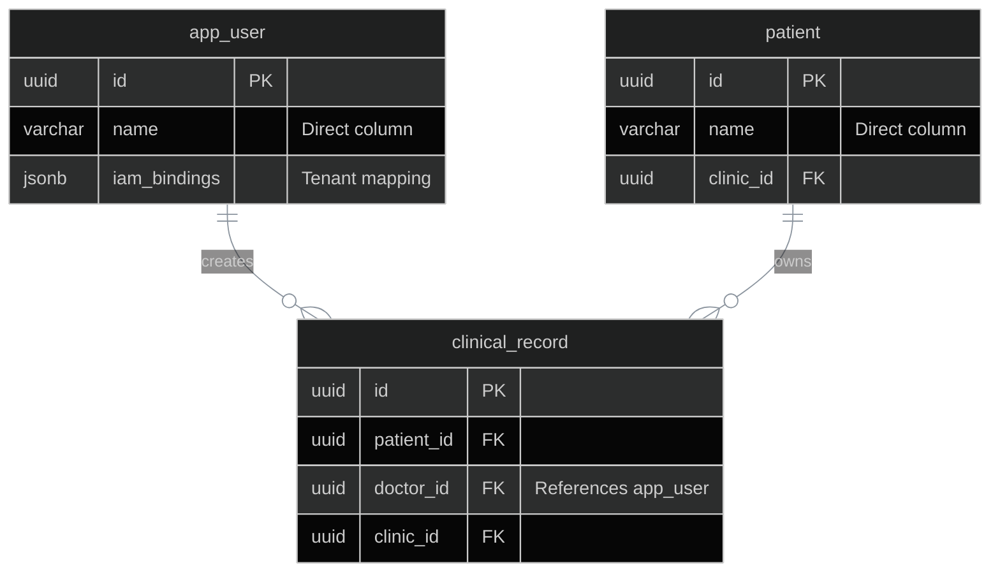
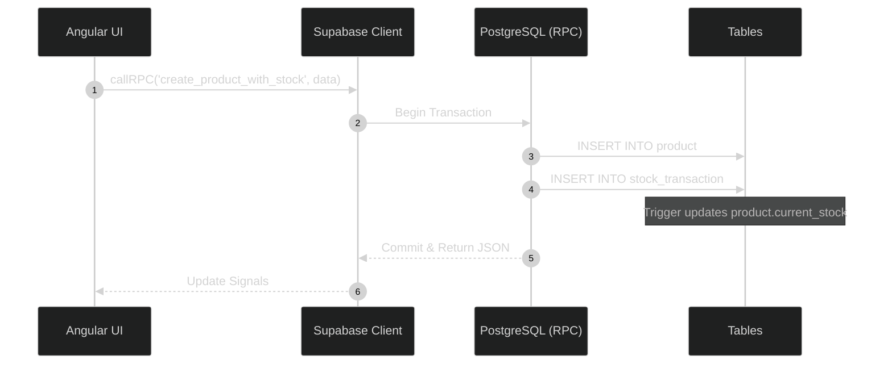
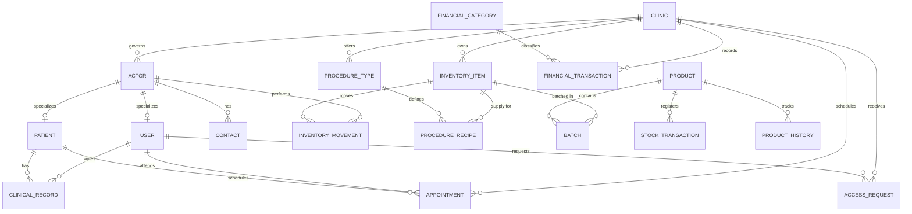

# Flattened Database Schema

IntraClinica uses Supabase (PostgreSQL) as its primary backend. Over time, the schema evolved from complex, abstracted multi-table inheritance models (like the legacy `actor` table) into a flattened, high-performance canonical schema.

This document details *why* the schema was simplified and *how* atomic operations handle complex data inserts.

## 1. The Flat Schema (Actor Table Deleted)

The legacy `actor` abstraction (which held shared properties like `name` and `contact_info`) was removed in migration `20260323000000_flatten_actor_model.sql`. This architectural shift improved performance by eliminating mandatory JOINs for basic entity information.

### Key Changes
- **`app_user`**: Now contains a direct `name` column (Source: `supabase/migrations/20260323000000_flatten_actor_model.sql:4`).
- **`patient`**: Now contains a direct `name` column (Source: `supabase/migrations/20260323000000_flatten_actor_model.sql:5`).
- **Unified References**: Tables like `appointment`, `clinical_record`, and `stock_transaction` now reference `app_user.id` or `patient.id` directly. References to `actor_id` or `doctor_actor_id` have been renamed to `user_id`, `doctor_id`, etc. (Source: `supabase/migrations/20260323000000_flatten_actor_model.sql:38-40`).

## 2. Recent Migrations (2026+)

The database has undergone significant hardening and feature expansion since March 2026.

| Migration File | Description |
| :--- | :--- |
| `20260321000001_hard_cleanup.sql` | Destructive consolidation. Merged `inventory_item` into `product`, automated stock syncing via triggers, and dropped legacy PascalCase tables. |
| `20260322000000_config_driven_ui.sql` | Introduced `ui_module`, `clinic_module`, and `clinic_config` tables to enable per-tenant feature toggling and UI customization. |
| `20260322230000_iam_rls_enforcement.sql` | Enforced RLS on all operational tables using `iam_bindings` context. |
| `20260323000000_flatten_actor_model.sql` | Deleted the `actor` table and migrated all names directly to `app_user` and `patient`. |
| `20260323000001_iam_core_system.sql` | Foundation of the IAM Role -> Grant -> Block system. Added `iam_permissions` and `iam_roles` catalogs. |
| `20260323000500_fix_product_cost_rpc.sql` | Corrected RPC mapping to ensure the frontend receives `cost` instead of `avg_cost_price`. |
| `20260323001000_create_medical_record_rpc.sql` | Implemented high-performance JSONB-based clinical record creation. |

## 3. RPC Catalog (Atomic Operations)

As per `AGENTS.md:89`, always use PostgreSQL RPCs for multi-table mutations to ensure atomicity. All multi-record mutations must use RPC functions (e.g., `create_product_with_stock`) — never double await `insert()` in Angular services.

| Function | Params | Returns | Purpose | Frontend |
|---|---|---|---|---|
| `create_medical_record` | `clinic_id`, `patient_id`, `doctor_id`, `content` (jsonb), `type` | `SETOF clinical_record` | Atomic medical record insert | `clinical.service.ts` |
| `create_product_with_stock` | `clinic_id`, `name`, `category`, `price`, `cost`, `min_stock`, `current_stock`, `barcode` | `jsonb` | Atomic product+stock insert | `inventory.service.ts` |
| `get_clinic_ui_config` | `p_clinic_id` uuid | `jsonb` | Batch clinic UI config fetch | ⚠️ NOT USED (direct table queries in admin-panel) |
| `has_permission` | `user_uuid`, `clinic_id`, `permission` | `boolean` | IAM evaluation for RLS | DB only |
| `has_clinic_access` | `target_clinic_id` | `boolean` | RLS: super admin or clinic binding | DB only |
| `has_clinic_role` | `target_clinic_id`, `target_role` | `boolean` | RLS: role check in clinic | DB only |
| `is_super_admin` | (none) | `boolean` | RLS: super admin check | DB only |

### `create_product_with_stock`
Atomically creates a product and its initial inventory transaction.
- **Input**: Clinic ID, Name, Category, Prices, Stock counts.
- **Logic**: Inserts into `product`, then conditionally inserts an `IN` movement into `stock_transaction` (Source: `supabase/migrations/20260323000500_fix_product_cost_rpc.sql:48`).
- **Return**: JSONB object mapped to frontend `Product` interface.

### `create_medical_record`
Creates a clinical evolution or exam entry with tenant validation.
- **Input**: Clinic ID, Patient ID, Doctor ID, Content (JSONB), Type.
- **Logic**: Verifies `has_clinic_access` before inserting into `clinical_record` (Source: `supabase/migrations/20260323001000_create_medical_record_rpc.sql:13`).

### `has_permission()`
The core engine of the IAM system used in RLS policies.
- **Logic**: Implements the **Role (Base) -> Grant (Concession) -> Block (Override)** hierarchy (Source: `supabase/migrations/20260323000001_iam_core_system.sql:81`).
- **Precedence**: Local blocks > Local grants > Local roles > Global blocks > Global grants > Global roles.

## 4. IAM & RLS Enforcement

Access control is no longer based on simple "type" strings. It relies on the `iam_bindings` JSONB column in `app_user`.

- **Multi-Tenant Isolation**: Every query is filtered by `clinic_id` via `has_clinic_access(clinic_id)`.
- **Permission Checks**: Functional access is checked via `has_permission(uid, clinic_id, 'permission.name')`.
- **Role Dictionary**: Standard roles like `roles/doctor` and `roles/clinic_admin` define the default permission sets (Source: `supabase/migrations/20260323000001_iam_core_system.sql:58`).

## 5. Complete Entity Relationship Diagram

The following diagram represents the canonical schema after all migrations:

::: info IAM Protected Document
This page contains technical database schema details. Access requires the `ai.use` permission.
:::
