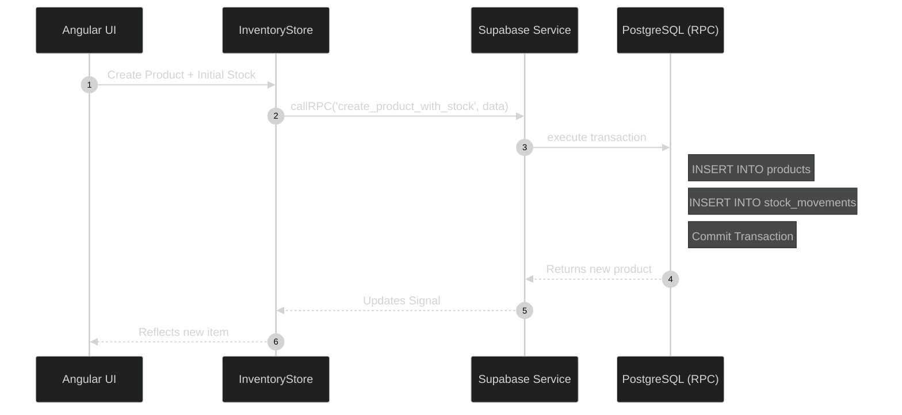

# Flattened Database Schema

IntraClinica uses Supabase (PostgreSQL) as its primary backend. Over time, the schema evolved from complex, abstracted multi-table inheritance models (like the legacy `actor` table) into a flattened, high-performance canonical schema.

This document details *why* the schema was simplified and *how* atomic operations handle complex data inserts.

## 1. The Death of the 'Actor' Abstraction

Historically, `patient`, `doctor`, and `staff` tables all referenced a parent `actor` table for shared attributes like `name` and `contact_info` (Source: `docs/DATABASE_SCHEMA.md` & `AGENTS.md:85`).

### Why Flatten?
Querying a patient's medical record required JOINs across three tables: `clinical_record` -> `patient` -> `actor`. This degraded performance as the database grew. 

We flattened the schema so `patient` and `app_user` (the new, unified staff/doctor table) contain their own `name` columns.

## 2. Atomic RPC Operations

With a flattened schema, creating an entity often requires inserting data into multiple related tables simultaneously. For example, creating a new product in the inventory requires:
1. Creating the `product` row.
2. Creating the initial `stock_movement` row to set the opening balance.

### Why not use multiple Angular API calls?

As per `AGENTS.md:89`, if Angular performs two `await this.supabase.insert()` calls, a network failure between the first and second call leaves the database in an inconsistent state (an orphaned product with no stock record).

Instead, PostgreSQL RPC (Remote Procedure Call) functions guarantee atomicity. If any step fails, the entire transaction rolls back.

Always use RPCs for multi-table inserts. Do not attempt to manage transaction states from the frontend.
