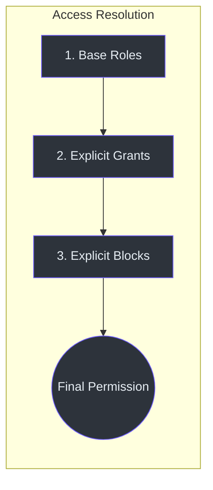
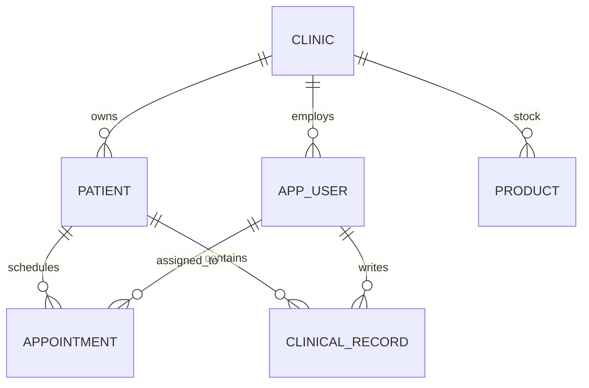

# Core Data Models

IntraClinica uses a **Flat Schema Architecture** to maintain performance and simplicity in its multi-tenant environment. This page documents the core models and their relationships.

## Key Principle: Flat Schema

Unlike legacy versions, this architecture eliminates deep nesting and abstraction tables like `actor`. Entities like `Patient` and `AppUser` contain their own identity data (e.g., `name`) directly.

- **No Nesting**: Use `patient.name`, not `patient.actor.name`.
- **Atomic Operations**: Operations spanning multiple tables or requiring initial state (e.g., creating a product with initial stock) are handled via PostgreSQL RPC functions.
- **Context Filtering**: Every entity (except Global IAM) MUST include a `clinic_id` for RLS (Row Level Security) and multi-tenant isolation.

## 1. IAM Models

The Identity and Access Management (IAM) system follows a **Role -> Grant -> Block** precedence model.

### UserIamBindings
Stored as a `jsonb` column in the `app_user` table. It maps clinic contexts to their respective access configurations.

| Property | Type | Description |
| :--- | :--- | :--- |
| `global` | `IamBindingContext` | SaaS-wide permissions (Super Admin tools). |
| `[clinicId]` | `IamBindingContext` | Tenant-specific permissions. |

(frontend/src/app/core/models/iam.types.ts:39)

### IamBindingContext
Defines the specific roles and cherry-picked overrides for a user in a given context.

| Property | Type | Description |
| :--- | :--- | :--- |
| `roles` | `string[]` | List of `IamRole.id` (e.g., `['roles/doctor']`). |
| `grants` | `string[]` | Explicitly permitted `IamPermission.id`. |
| `blocks` | `string[]` | Explicitly denied `IamPermission.id` (Precedence Absolute). |

(frontend/src/app/core/models/iam.types.ts:33)



## 2. Patient Model

The `Patient` entity is the primary record for medical care.

| Property | Type | Description |
| :--- | :--- | :--- |
| `id` | `string` | UUID primary key. |
| `clinic_id` | `string` | Owner clinic UUID. |
| `name` | `string` | Full name (Flat). |
| `cpf` | `string \| null` | Brazilian Tax ID. |
| `birth_date` | `string \| null` | ISO date string. |
| `phone` | `string \| null` | Contact number. |

(frontend/src/app/core/services/patient.service.ts:5)

## 3. Appointment Model

Represents a scheduled encounter between a patient and a provider.

| Property | Type | Description |
| :--- | :--- | :--- |
| `id` | `string` | UUID primary key. |
| `clinic_id` | `string` | Owner clinic UUID. |
| `patient_id` | `string` | FK to `patient.id`. |
| `patient_name` | `string` | Denormalized name for list performance. |
| `doctor_id` | `string \| null` | FK to `app_user.id`. |
| `appointment_date` | `string` | Scheduled timestamp. |
| `status` | `string` | e.g., 'Agendado', 'Confirmado', 'Atendido'. |

(frontend/src/app/core/services/appointment.service.ts:5)

## 4. Product Model

Standard entity for inventory and sales tracking.

| Property | Type | Description |
| :--- | :--- | :--- |
| `id` | `string` | UUID primary key. |
| `clinic_id` | `string` | Owner clinic UUID. |
| `name` | `string` | Product name. |
| `category` | `string` | e.g., 'Medicamento', 'Consumível'. |
| `price` | `number` | Selling price. |
| `cost` | `number` | Average cost price (DB: `avg_cost_price`). |
| `current_stock` | `number` | Live stock quantity. |

(frontend/src/app/core/services/inventory.service.ts:5)

## 5. Clinical Record Model

The medical documentation of a patient encounter.

| Property | Type | Description |
| :--- | :--- | :--- |
| `id` | `string` | UUID primary key. |
| `clinic_id` | `string` | Owner clinic UUID. |
| `patient_id` | `string` | FK to `patient.id`. |
| `doctor_id` | `string` | FK to `app_user.id` (The authoring doctor). |
| `type` | `MedicalRecordType` | e.g., 'EVOLUCAO', 'RECEITA', 'EXAME'. |
| `content` | `jsonb` | Structured clinical data (MedicalRecordContent). |

(frontend/src/app/core/services/clinical.service.ts:15)

### MedicalRecordContent (JSON Structure)
```json
{
  "chief_complaint": "string",
  "observations": "string",
  "diagnosis": "string",
  "prescriptions": "string"
}
```
(frontend/src/app/core/services/clinical.service.ts:8)

## Relationship Overview


