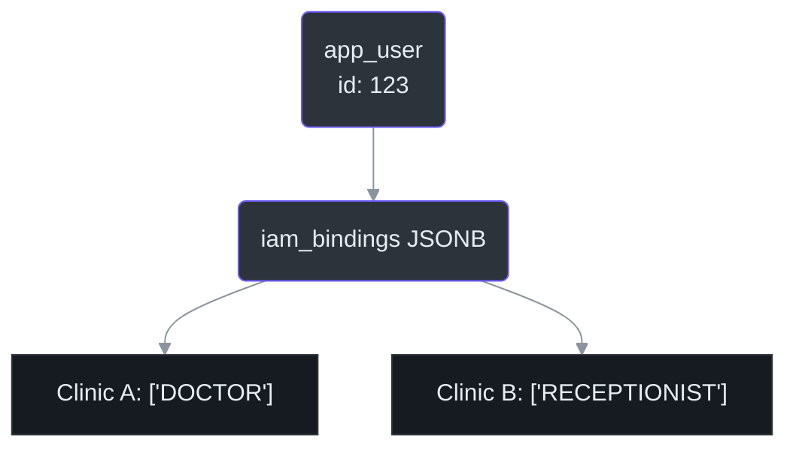
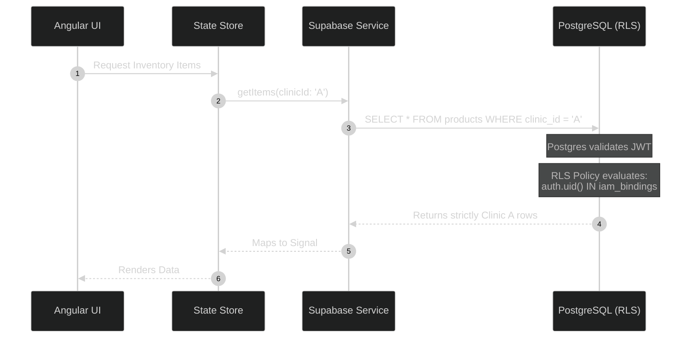

# Multi-Tenant Security & Isolation

The most critical architectural requirement of IntraClinica is absolute data isolation between tenants (clinics). A user in Clinic A must never, under any circumstances, access data from Clinic B.

This document explains *why* we moved away from legacy abstraction tables and *how* we enforce security at both the Database (PostgreSQL RLS) and Application (Angular) layers.

## 1. The IAM Bindings Strategy

Historically, identifying a user's role (e.g., Doctor vs. Receptionist) relied on a static `type` column in a monolithic `actor` table. This failed in a multi-tenant environment because a single user might be a Doctor at Clinic A but only a Receptionist at Clinic B.

We solved this by introducing the `iam_bindings` JSONB column in the `app_user` table (Source: `AGENTS.md:73`).

### Why JSONB for IAM?
Using JSONB allows us to map a single `user_id` to multiple clinics with distinct roles without creating complex junction tables that degrade query performance.

When querying for doctors in a specific clinic, the frontend constructs queries checking if the JSONB payload contains the specific clinic key with the 'DOCTOR' array element.

## 2. Row Level Security (RLS)

At the database level, every table containing tenant-specific data must have a `clinic_id` column.

PostgreSQL Row Level Security (RLS) policies are written to evaluate the authenticated user's JWT token against the `clinic_id` of the row being accessed.

### The Flow of a Secured Request

## 3. Frontend Context Enforcement

In the Angular application, localized features (e.g., `features/inventory/`, `features/clinical/`) must always be aware of the active clinic context.

As mandated by `AGENTS.md:78`, you must always retrieve the active clinic ID via the context service:
`const clinicId = this.context.selectedClinicId();`

**Critical Rule:** Never fetch, display, or mutate data if `clinicId === 'all'` or `null`. The UI must abort the operation or show an empty state to prevent data corruption or cross-tenant leaks.
