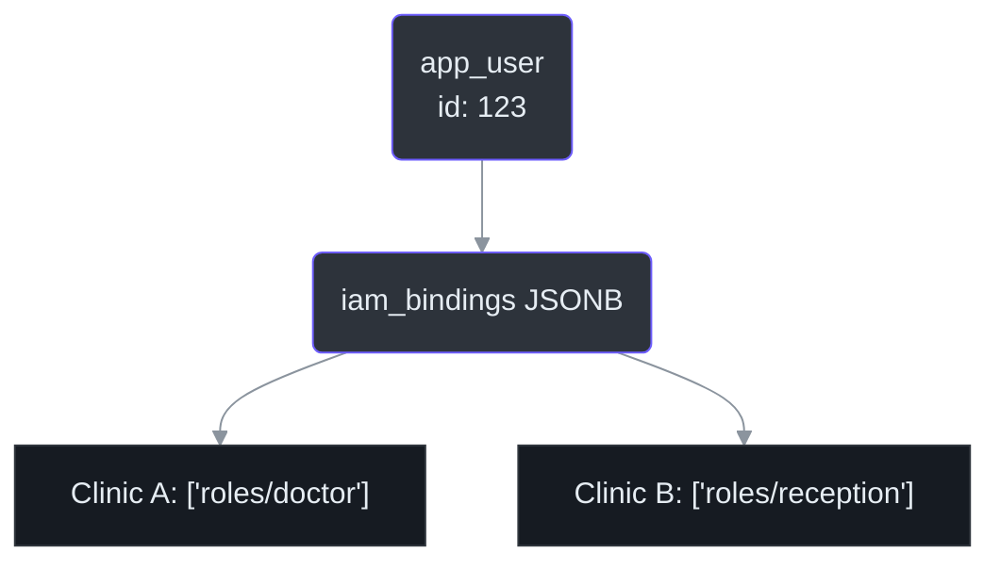
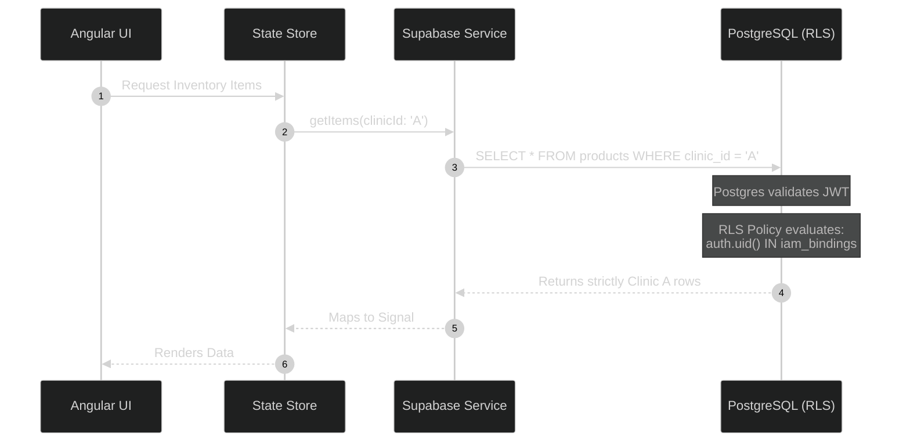

# Multi-Tenant Security & Isolation

The most critical architectural requirement of IntraClinica is absolute data isolation between tenants (clinics). A user in Clinic A must never, under any circumstances, access data from Clinic B.

This document explains *why* we moved away from legacy abstraction tables and *how* we enforce security at both the Database (PostgreSQL RLS) and Application (Angular) layers.

## 1. The IAM Bindings Strategy

IntraClinica uses a hierarchical IAM (Identity and Access Management) model based on the **Role → Grant → Block** pattern. This ensures that permissions are granular and clinic-specific.

We solved the multi-tenancy challenge by introducing the `iam_bindings` JSONB column in the `app_user` table (Source: `AGENTS.md:73`). This column stores a mapping of clinic IDs to their respective roles and specific permission overrides.

### Why JSONB for IAM?
Using JSONB allows us to map a single `user_id` to multiple clinics with distinct roles and granular permissions without creating complex junction tables that degrade query performance.

When querying for doctors or verifying access in a specific clinic, the system evaluates the JSONB payload. For example, to check if a user can read clinical records, we verify the presence of the `clinical.read_records` permission, which is typically granted by the `roles/doctor` role.

## 2. Row Level Security (RLS)

At the database level, every table containing tenant-specific data must have a `clinic_id` column.

PostgreSQL Row Level Security (RLS) policies are written to evaluate the authenticated user's JWT token against the `clinic_id` of the row being accessed. Instead of legacy functions like `is_super_admin()`, we now use the `has_permission()` RPC function, which internally handles role hierarchies, grants, and blocks.

### Key IAM Functions
- **`has_permission(permission_key)`**: The primary RPC for checking if the current user has a specific grant in the active clinic.
- **`has_clinic_role(role_key)`**: Now superseded by `has_permission()` with the `roles/<role>` permission key for internal consistency.

### The Flow of a Secured Request

## 3. Frontend Context Enforcement

In the Angular application, localized features (e.g., `features/inventory/`, `features/clinical/`) must always be aware of the active clinic context and user permissions.

As mandated by `AGENTS.md:78`, you must always retrieve the active clinic ID via the context service:
`const clinicId = this.context.selectedClinicId();`

### Permission Checks (`IamService`)
Before executing UI actions, always verify permissions using the `IamService.can()` method. This API integrates with the hierarchical IAM model to determine if the user has the required grant (or role) for the active clinic.

**Critical Rule:** Never fetch, display, or mutate data if `clinicId === 'all'` or `null`. The UI must abort the operation or show an empty state to prevent data corruption or cross-tenant leaks.
