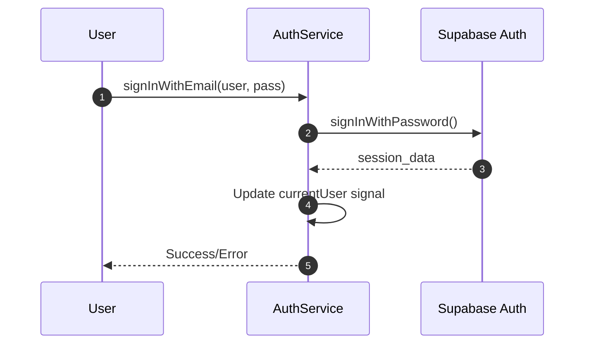
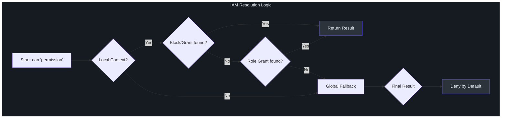

# Core Services Architecture

IntraClinica relies on a set of high-performance singleton services that manage global state, authentication, database communication, and security evaluation. These services follow a strict Signal-based pattern to ensure consistent reactivity across the application.

## 1. ClinicContextService
The `ClinicContextService` is the primary orchestrator of the multi-tenant experience. It tracks which clinic is currently active, which in turn filters all data fetching and UI state.

- **File Path**: `core/services/clinic-context.service.ts`
- **Primary Signal**: `selectedClinicId` (file: `clinic-context.service.ts:8`)
- **Isolation Pattern**: Every feature module (Inventory, Reception, etc.) depends on this signal to determine the data scope.

### Usage Pattern
```typescript
// Example: Consuming the context in a feature store
const clinicId = this.clinicCtx.selectedClinicId();
if (!clinicId) return []; // Multi-tenant safety guard
```

<br>

## 2. AuthService
Manages the user's lifecycle from login to session persistence. It acts as a high-level wrapper around Supabase Auth, exposing the user state as reactive signals.

- **File Path**: `core/services/auth.service.ts`
- **Key Methods**: `signInWithEmail()`, `signOut()` (file: `auth.service.ts:31-37`)
- **Reactive State**: `currentUser()` and `currentSession()` signals provide instant access to the logged-in identity without manual subscription management.



<br>

## 3. SupabaseService
A lightweight wrapper that initializes and exposes the `SupabaseClient`. It ensures that a single client instance is shared across the entire Angular ecosystem.

- **File Path**: `core/services/supabase.service.ts`
- **Access**: Via the `clientInstance` getter (file: `supabase.service.ts:15`).
- **Pattern**: Direct table access (`.from('table')`) and RPC calls (`.rpc('fn')`) are executed through this client.

<br>

## 4. IamService
The "Security Brain" of the application. It implements a **Fail-Loud** philosophy where permissions are strictly evaluated locally using a cached JSONB binding matrix.

- **File Path**: `core/services/iam.service.ts`
- **Core Method**: `can(permissionKey: string): boolean` (file: `iam.service.ts:84`)
- **Initialization**: Downloads the `iam_roles` and `iam_permissions` dictionaries once per session (file: `iam.service.ts:42`).

### Fail-Loud Philosophy
The `IamService` assumes a "Deny by Default" stance. If the service is not initialized or a binding is missing, `can()` returns `false` immediately. This prevents UI leaks even if the network is unstable.

### Permission Evaluation Flow
The service resolves permissions in milliseconds using the following priority:
1. **Block Local**: Explicitly blocked for the specific clinic.
2. **Grant Local**: Explicitly granted for the specific clinic.
3. **Role Local**: Included in the roles assigned to the user for that clinic.
4. **Global Fallback**: Evaluated against the `global` context in `iam_bindings`.



## Service Summary Table

| Service | Responsibility | Main Signal/Data |
| :--- | :--- | :--- |
| **ClinicContext** | Multi-tenant scope | `selectedClinicId` |
| **Auth** | Identity & Session | `currentUser` |
| **Supabase** | DB Communication | `clientInstance` |
| **IAM** | Access Control | `userBindings` |

## References
- See [Database Schema](./database.md) for Row Level Security details.
- See [IAM Security Model](./iam-security-model.md) for deep-dive on JSONB bindings.
