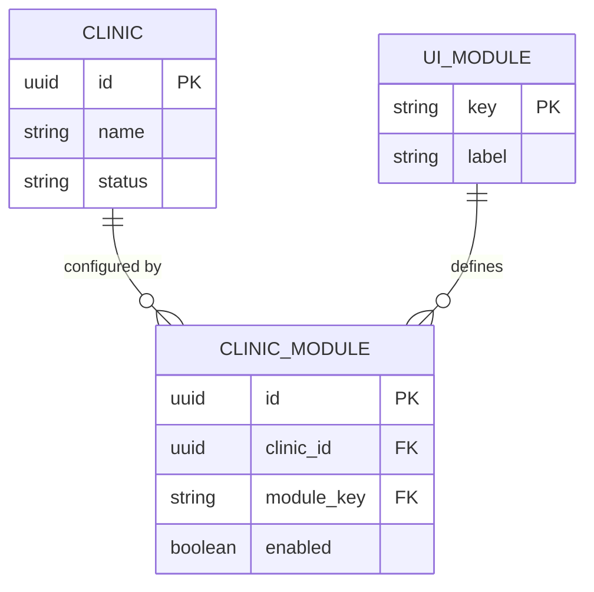
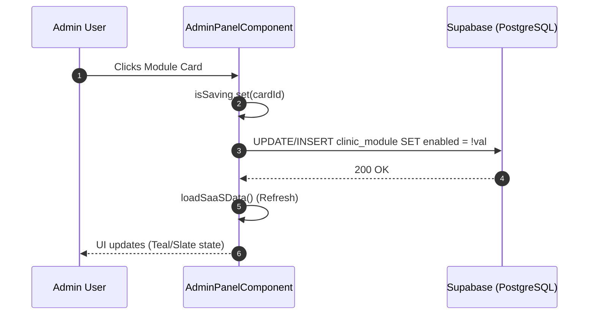

# Admin Panel (SaaS Global Governance)

The **Admin Panel** is the primary governance interface for the IntraClinica SaaS platform. It provides a centralized view for platform administrators to manage multi-tenant clinics, monitor their status, and granularly toggle functional modules (UI Config) per tenant.

## Overview
Unlike standard feature modules that operate within a single clinic context, the Admin Panel operates at the **Global Level** (context `all`). It is designed for platform owners to control which features are "purchased" or active for each clinic in the database.

## IAM Gates
Access to the Admin Panel is strictly controlled via the IAM binding system. It is not restricted to a specific `clinic_id` but rather to global administrative capabilities.

- **`clinics.manage`**: Grants visibility to the clinic list and the ability to toggle functional modules.
- **`users.manage`**: (Planned/Extended) Grants the ability to manage global platform users and their cross-tenant bindings.

> [!IMPORTANT]
> The route `/admin` is guarded to ensure only users with these specific permissions in their `iam_bindings` can initialize the component.

## Features

### 1. SaaS Metrics Dashboard
The Admin Panel now includes a **Metrics Dashboard** at the top showing key platform statistics:
- **Total Clinics**: Count of active clinics in the platform
- **Total Users**: Count of registered users across all clinics
- **Pending Access Requests**: Number of access requests awaiting approval

### 2. Quick Actions
Quick action buttons for common administrative tasks:
- Link to manage clinics
- Link to manage users

### 3. Clinic Governance List
Displays all clinics registered in the platform, showing their status (e.g., `active`, `inactive`) and unique identifiers.
- **Source**: `frontend/src/app/features/admin-panel/admin-panel.component.ts:141`
- **Data**: Fetches directly from the `clinic` table.

### 4. Module Toggle (UI Config)
Platform admins can enable or disable specific UI modules for any clinic. This directly impacts the sidebar navigation and feature access for the end-users of that specific clinic.
- **Modules Tracked**: `reception`, `clinical`, `inventory`, `patients`.
- **Mechanism**: Toggling a card performs an `upsert` (Update or Insert) on the `clinic_module` table.
- **Verification**: Changes are immediate and reflected after a background data refresh (frontend/src/app/features/admin-panel/admin-panel.component.ts:179).

### 5. Recent Activity Log
Displays recent platform activity such as new user registrations.

## Data Model

The Admin Panel relies on three core tables to manage the SaaS state:

| Table | Purpose | Key Columns |
|-------|---------|-------------|
| `clinic` | Multi-tenant root | `id`, `name`, `status` |
| `ui_module` | Global feature catalog | `key`, `label`, `description` |
| `clinic_module` | Tenant-specific configuration | `clinic_id`, `module_key`, `enabled` |

## Technical Notes

### Query Pattern Inconsistency
The `AdminPanelComponent` currently utilizes **direct table queries** via the Supabase client (`this.db.from('clinic').select('*')`) rather than the standardized `get_clinic_ui_config` RPC used by the rest of the application. 

- **Reason**: The panel requires write-access (INSERT/UPDATE) to the configuration tables, which the read-only RPC does not provide.
- **Implementation**: (frontend/src/app/features/admin-panel/admin-panel.component.ts:116)

### State Management
The component uses Angular **Signals** for reactive state:
- `clinics`: List of all tenants.
- `availableUiModules`: The global catalog of what can be enabled.
- `clinicModules`: The current state of all module/clinic pairings.

## Related Permissions
- **Wiki Access**: Viewing internal documentation like this page is controlled by the `ai.use` permission in the `iam_bindings`, following the repository's access control principles.
- **Clinical/Inventory/Reception**: These modules only appear for a clinic if the `clinic_module` entry for that clinic has `enabled: true`.
