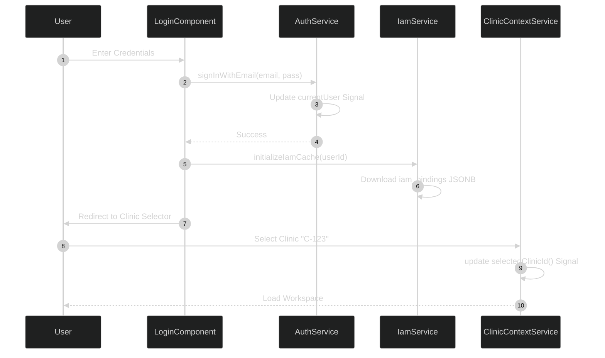

# Feature: Auth & IAM

The Auth module provides a secure gateway to the IntraClinica ecosystem. It leverages Supabase Auth for identity and a custom, multi-tenant IAM engine for granular permission control.

## 1. Overview

IntraClinica uses a **Multi-Tenant SaaS** architecture where a single user identity can access multiple clinic contexts. The authentication flow is divided into two phases:
1.  **Identity Verification**: Supabase Auth (Email/Password or OTP).
2.  **Context Selection**: Determining which clinic the user is currently operating in.

## 2. IAM Gates (The Security Engine)

The system implements a proactive, hierarchy-based security model inspired by cloud provider IAMs (Source: `frontend/src/app/core/models/iam.types.ts`).

### The Permission Resolver
Access is resolved by the `IamService.can(permissionKey)` method, which evaluates permissions locally in milliseconds using a cached **Binding Matrix** (Source: `frontend/src/app/core/services/iam.service.ts:84`).

| Logic Level | Description | Precedence |
| :--- | :--- | :--- |
| **1. Local Block** | Explicitly denied in the clinic context. | **Highest** (Deny always wins) |
| **2. Local Grant** | Explicitly granted in the clinic context (Cherry-picked). | High |
| **3. Local Role** | Inherited from the Roles assigned to the clinic context. | Medium |
| **4. Global Context** | Fallback to `global` bindings (SaaS-wide permissions). | Low |

### Example Permission Check
```typescript
// Component-level check (Source: main-layout.component.ts)
const canUseAi = this.iam.can('ai.use');
```

## 3. Auth Flow



## 4. Services (Auth & Context)

### AuthService
The single source of truth for authentication state (Source: `frontend/src/app/core/services/auth.service.ts`).
- `currentUser`: A signal containing the Supabase User object.
- `currentSession`: A signal for the active JWT session.
- `signInWithEmail()`: Wrapper for Supabase Auth login.

### ClinicContextService
Manages the active tenant ID across the application (Source: `frontend/src/app/core/services/clinic-context.service.ts`).
- `selectedClinicId`: A signal representing the active clinic.
  - Value `'all'`: Super Admin global view.
  - Value `null`: No clinic selected.
  - Value `UUID`: Specific clinic context.

## 5. LoginComponent

The `LoginComponent` (Source: `frontend/src/app/features/auth/login.component.ts`) is a standalone component using Angular 18 reactive forms and Tailwind CSS.

- **Signals**: Uses `isLoading` and `errorMessage` for reactive UI feedback.
- **Control Flow**: Implements `@if` blocks for error states and loading spinners.
- **Icons**: Uses `lucide-angular` (Mail, Lock, LogIn).

## 6. Security Notes

1.  **Row Level Security (RLS)**: While the frontend uses `IamService` for UI gating, the PostgreSQL database enforces strict RLS. Data is filtered based on the `iam_bindings` column in the `app_user` table.
2.  **Doctor Identification**: The system no longer uses a static `type` column. To identify if an actor is a doctor, the query must check for the `roles/doctor` binding in the active clinic context.
3.  **Token Refresh**: Session persistence and token refreshing are handled automatically by the Supabase Client embedded in the `AuthService`.
