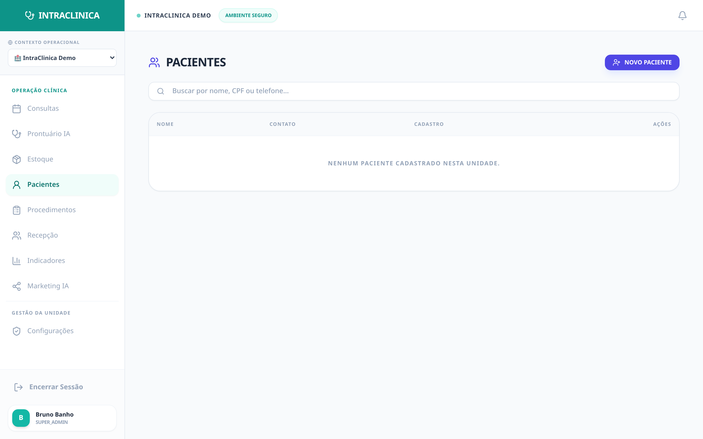
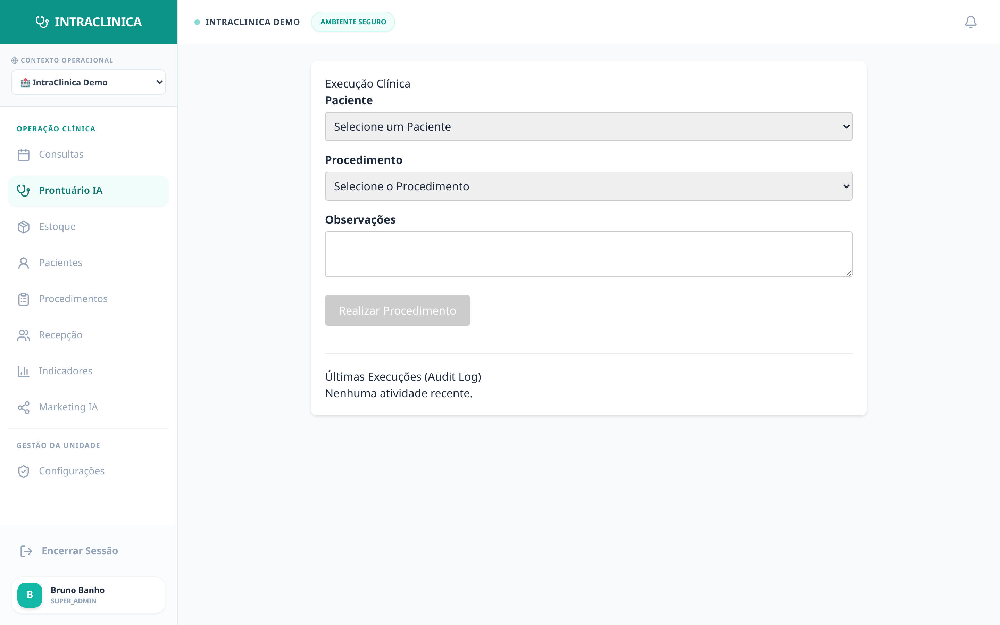

# Case Study 03: Complex Record vs. Short Time (The Bureaucracy Cure)

The doctor-patient relationship is the most valuable asset of a clinic. When the doctor spends the entire appointment looking at the keyboard and typing histories, the patient feels ignored.

---

## 🌪️ The Scenario (Bureaucracy)

An elderly patient enters the room.

*(The patient has a long history in the clinic's database).*

With a 4-year history at the clinic and 12 previous appointments, the doctor doesn't have the physical time to read the complete history in the allocated 15 minutes. They end up asking repetitive questions ("Do you really have an allergy to any medication?"), breaking the rapport and losing precious minutes.

## ⚙️ Step 1: The End of "Searching Old Folders"

The *Clinical* module (Medical Record) of IntraClinica isn't an "online Word". It's a medical intelligence tool.

*(View of Clinical Execution).*

**Instant NEXUS Summary:** Before the patient enters, the doctor presses a single button: "NEXUS Summary." AI scans 4 years of records, exams, and old prescriptions in milliseconds and generates a 4-line paragraph:
   > *"Elderly patient, hypertensive, **allergic to dipyrone**. Last appointment (3 months ago) adjusted Losartan dose. Chronic lower back pain that worsens when lying down. Watch blood pressure today."*

## ⚙️ Step 2: The End of Typing (Evolution by Audio)

The doctor attends to the patient looking in their eyes. Doesn't touch the keyboard.
At the end of the consultation, they click the platform's microphone and dictate messy stream of consciousness:
   > *"Your Carlos came back today. The lower back pain got worse when lying down, he remembered he's allergic to dipyrone, I prescribed a muscle relaxant at night and scheduled an urgent resonance."*

## 🧠 Step 3: The NEXUS Magic (SOAP Medical-Legal Standard)

The AI engine (connected to Google Gemini) processes the raw audio. It doesn't do a simple transcription—it has structural and medical knowledge embedded:
- It **formats the anamnesis in the official SOAP standard** (Subjective, Objective, Assessment, Plan).
- It **extracts and tags the allergy** "allergic to dipyrone", creating a Red Safety Alert on the patient's cover for future appointments.
- It generates the final document with immutable signature (*timestamp* on Supabase).

## 📈 The Operational Result

In 10 seconds, the doctor has a perfect medical-legal record. The patient leaves enchanted with uninterrupted, humanized attention, drastically increasing the word-of-mouth referral rate.

---

**Related Case Studies:**
- [Case 02: Inventory Rupture](./inventory-rupture-case) — Stock tied to procedures
- [Case 04: Medical Marketing](./marketing-ai-case) — AI content generation
