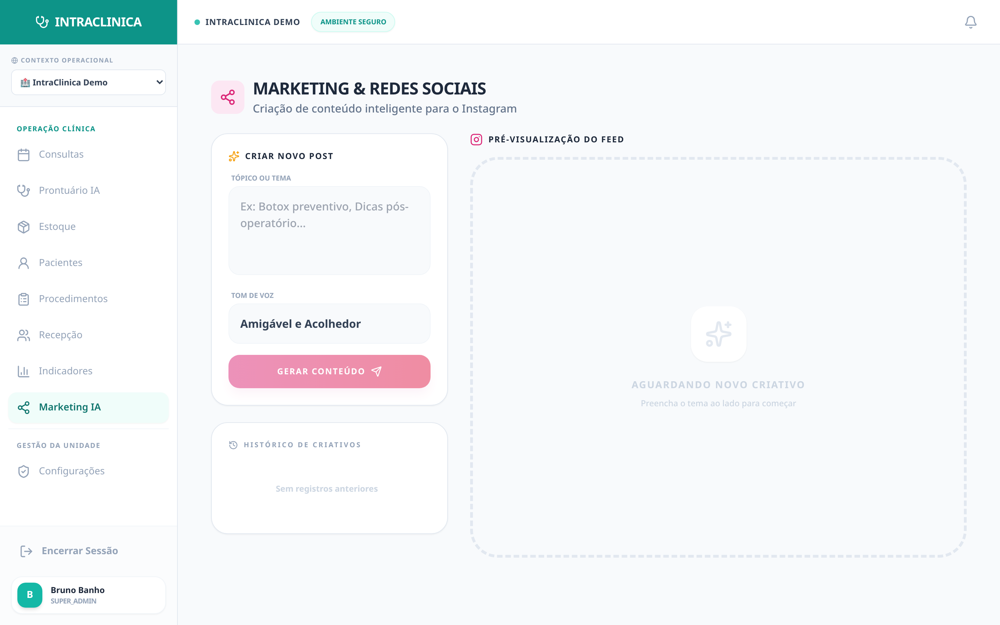

# Case Study 04: The "Creative Block" of Medical Marketing

**Attracting particular patients in the digital age is the only shield against dependence on low-remuneration health insurance plans.** However, after seeing 20 patients in a day, a doctor doesn't have the cognitive energy to write "Instagram Reels scripts".

---

## 🌪️ The Scenario (Marketing Friction)

Thursday, 7:30 PM. The doctor finishes their appointments. The marketing agency charges for "content" for tomorrow morning. The doctor opens a text editor and can't formulate a single technical phrase that attracts lay patients. The post isn't made, and marketing dies from creative block, emptying next month's schedule. The agency charges expensively and constantly makes mistakes in medical jargon.

## ⚙️ Step 1: The "Seed of Knowledge"

The *Social AI* module doesn't replace a human strategist but zeroes out the friction of primary content creation.

*(View of the AI Content Generation Interface).*

The doctor (or clinic manager) enters the panel, clicks the generator, and types their "stream of consciousness" in a single sentence:
> *"Importance of drinking water in winter"*

## ⚙️ Step 2: The Clinic's Voice Tone

They choose the clinic's exact **Voice Tone** in the *dropdown* (e.g., *Human and Welcoming* or *Professional and Technical*). This ensures all posts maintain the brand's personality.

## 🧠 Step 3: The NEXUS Magic (How AI Acts)

The "Generate with Artificial Intelligence" button is pressed. The embedded AI (*Google Gemini*) doesn't throw generic Wikipedia text. The system has hidden *prompts* drawn with **medical marketing engineering** (Mental Triggers, Retention, Call to Action).
- **Ready Copywriting:** The generated response is a rich caption, already spaced for Instagram, engaging and scientifically grounded.
- **Video Scripting (Reels/TikTok):** AI also delivers a video script broken into three visual acts (Ex: *Scene 1:* "Hook - 3 seconds"; *Scene 2:* "Simplified technical explanation"; *Scene 3:* "CTA (Call to Action) for scheduling via bio link").
- **Localized Hashtags:** AI injects conversion hashtags (`#HealthInWinter #ClinicX #PreventiveMedicine`).

## 📈 The Financial Result

Medical marketing gains production cadence (scalability). The doctor takes 30 seconds to generate and review an impeccable post, actively feeding social networks without depending on third parties, without creative block, and drastically lowering the Patient Acquisition Cost (PAC).

---

**Related Case Studies:**
- [Case 03: AI Medical Records](./clinical-ai-case) — AI integration patterns
- [Case 05: SaaS Governance](./saas-governance-case) — Multi-tenant marketing module
