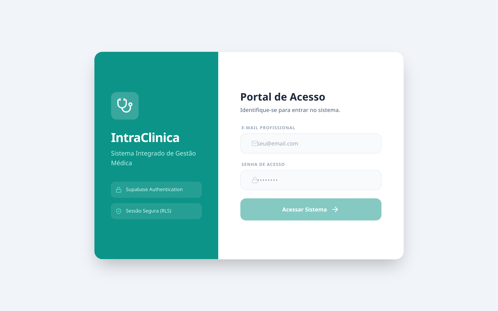
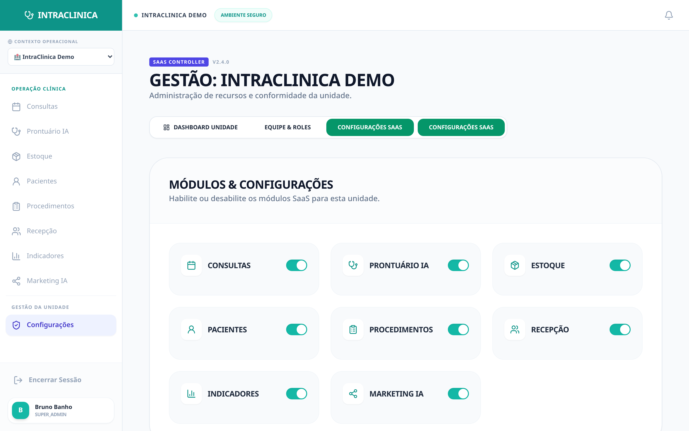
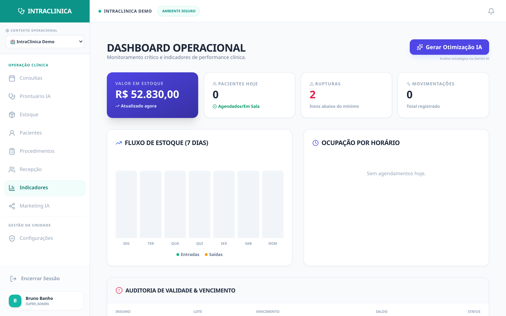

# Case Study 05: The Magic Screen (Config-Driven UI) and Multi-Tenancy

Generic medical software is made for all specialties and, paradoxically, doesn't serve anyone. A psychology clinic (that only sells 50-minute sessions) doesn't need and shouldn't see "Stock" or "Syringes" buttons.

---

## 🌪️ The Scenario (The Rigidness Pain)

The investor closes a deal with a third-party partner and creates a "New Clinic" in the SaaS panel. When the local manager of this new clinic enters the system, they face a polluted environment and tries to access another unit's schedule without success, or the receptionist sees entire tabs that aren't part of their work.

*(The SUPER_ADMIN at the login moment to manage all franchise units).*

**The Technical Reality:** The SaaS developer enters the panel, the newly created "New Clinic" ("nova clinica") is a sterile environment. There's not 1 patient, not 1 procedure listed in the inventory, the day's schedule is completely blank (empty). The system only exists on paper for it.

## ⚙️ Step 1: Action in IntraClinica (Dynamic Interface Controlled by Database)

The IntraClinica interface is **Config-Driven UI**.

*(The "SaaS Settings" tab in the Administrative Panel).*

The Investor/Super Admin has the ecosystem vision and the *Tenants* (Clinics).

## ⚙️ Step 2: "Turn Modules On/Off"

The panel shows the list of all *features* of the SaaS. The investor simply unchecks the "Supply Management" (Stock) or "Procedures" box for the Psychology clinic, but leaves it activated for the Dermatology clinic.

## 🧠 Step 3: The NEXUS Magic (How Engineering Acts)

The magic happens in two deep layers of modern software engineering (Angular Signals + Supabase RLS):

*   **1. Row Level Security (RLS - Multi-Tenant Database Security):**
    *   When the "New Clinic" is instantiated by the Global Administrator, the Supabase database raises isolated cryptographic walls (`auth.clinic_id()`). No patient, stock, or financial data from "Pilot Clinic" (the chaotic, packed clinic we saw in other screenshots) leaks to the new unit.
    *   *The Intentional Void:* The new unit is an isolated desert. This isn't a *bug*, it's the greatest protection against data leakage (LGPD) the investor can guarantee. It's impossible for a doctor from one unit to access another unit's schedule without explicit IAM permission with Administrator privileges.

*   **2. The Screen Transmutes in Milliseconds:**
    *   When the Global Admin clicks "Turn Off Stock Module", the reactive response (Signals) of Angular doesn't need to *reload* the screen of the user logged into that unit.
    *   The side menu on that clinic manager's screen flashes and **the "Stock and Labels" button disappears from the interface immediately**. The navigation bar (`/inventory`) is physically cleaned and extirpated from the employee's vision, simplifying the system's learning curve to strictly focus on that niche operation's profit.

## 📈 The Technical Result

A truly governed **Software as a Service (SaaS)**, globally modularized and with strict data protection (LGPD/Multi-Tenant Security), eliminating the "Frankenstein Syndrome" of UI that affects old market systems. The "Indicators (Reports)" panel also reflects these exclusions instantly.

*(Management reports and graphs accurately reflect only the modules the clinic contracted).*

---

**Related Case Studies:**
- [Case 01: No-Show Prevention](./no-show-case) — Multi-tenant scheduling
- [Case 02: Inventory Rupture](./inventory-rupture-case) — Per-clinic stock management
