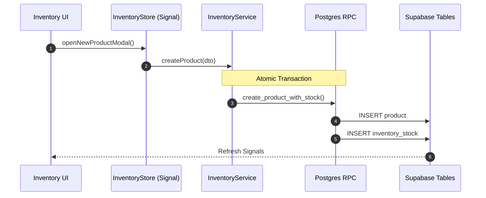

# Inventory Module

The Inventory module (`features/inventory/`) handles products, stock levels, warehouse transfers, and dispense operations tied to clinical prescriptions. It ensures that clinics maintain optimal supply levels while providing a full audit trail of movements.

## IAM Permissions

Access to inventory data and operations is controlled by three distinct permission tiers in the `iam_bindings` configuration.

| Permission | Description | Access Level |
|------------|-------------|--------------|
| `inventory.read` | View product catalog, current stock levels, and basic metadata. | Basic Staff |
| `inventory.write` | Add/deduct stock, create new products, and edit basic product info. | Stock Clerks / Admins |
| `inventory.view_cost` | View sensitive cost price and supplier data. | Managers / Owners |

> [!IMPORTANT]
> The `inventory.view_cost` permission is required to see the `avg_cost_price` and total stock value in the dashboard (frontend/src/app/features/inventory/inventory.component.ts:103).

## Data Model

### `product`

Master catalog of available products/medications.

```sql
product {
  id               uuid PRIMARY KEY DEFAULT gen_random_uuid()
  clinic_id        uuid REFERENCES clinic(id)  -- NULL = multi-clinic catalog
  name             text NOT NULL
  sku              text UNIQUE
  barcode          text
  category         text  -- e.g., 'medication', 'supply', 'equipment'
  unit             text  -- e.g., 'tablet', 'ml', 'box'
  price            numeric(10,2) DEFAULT 0
  avg_cost_price   numeric(10,2) DEFAULT 0
  created_at       timestamptz DEFAULT now()
}
```

### `inventory_stock`

Current stock level per product per clinic warehouse.

```sql
inventory_stock {
  id             uuid PRIMARY KEY DEFAULT gen_random_uuid()
  clinic_id      uuid NOT NULL REFERENCES clinic(id)
  warehouse_id   uuid REFERENCES warehouse(id)
  product_id     uuid NOT NULL REFERENCES product(id)
  quantity       integer NOT NULL DEFAULT 0
  min_quantity   integer DEFAULT 0       -- low-stock alert threshold
  updated_at     timestamptz DEFAULT now()
  UNIQUE(clinic_id, warehouse_id, product_id)
}
```

## Atomic Operations (RPC)

Stock updates must always be atomic to prevent race conditions. IntraClinica uses PostgreSQL RPC functions for all critical movements.

### Product Creation

The `create_product_with_stock` RPC handles the simultaneous creation of a product catalog entry and its initial stock level in a single transaction.

```sql
-- Implementation in frontend/src/app/core/services/inventory.service.ts:58
CREATE OR REPLACE FUNCTION create_product_with_stock(
  p_clinic_id     UUID,
  p_name          TEXT,
  p_category      TEXT,
  p_price         NUMERIC,
  p_cost          NUMERIC,
  p_min_stock     INTEGER,
  p_current_stock INTEGER,
  p_barcode       TEXT
) RETURNS product AS $$
DECLARE
  v_product product;
BEGIN
  INSERT INTO product (clinic_id, name, category, price, avg_cost_price, barcode)
  VALUES (p_clinic_id, p_name, p_category, p_price, p_cost, p_barcode)
  RETURNING * INTO v_product;

  INSERT INTO inventory_stock (clinic_id, product_id, quantity, min_quantity)
  VALUES (p_clinic_id, v_product.id, p_current_stock, p_min_stock);

  RETURN v_product;
END;
$$ LANGUAGE plpgsql;
```

### Dispensing & Transfers

- **`dispense_inventory`**: Deducts stock and creates an audit trail (`inventory_transaction`) atomically.
- **`transfer_inventory`**: Moves stock between two warehouses within the same clinic.

## UI Features

### Product Modal
The `ProductModalComponent` (frontend/src/app/features/inventory/product-modal/product-modal.component.ts) handles new product intake.

| Field | Requirement | Permission Required |
|-------|-------------|---------------------|
| Name | Mandatory | `inventory.write` |
| Category | Optional | `inventory.write` |
| Selling Price | Mandatory (>=0) | `inventory.write` |
| Cost Price | Mandatory (>=0) | `inventory.view_cost` |
| Initial Stock | Mandatory (>=0) | `inventory.write` |
| Min. Stock | Mandatory (>=0) | `inventory.write` |

### Filtering & Alerts
Implemented in recent updates (PR #71), the inventory dashboard now supports:

1. **Category Filtering**: A dynamic dropdown appears if more than two product categories exist (frontend/src/app/features/inventory/inventory.component.ts:119).
2. **Low-Stock Highlighting**: Cards turn red and display an "Abaixo do Mín." badge when `current_stock < min_stock`.
3. **Audit Trail**: All movements are logged in `inventory_transaction` via RPC calls.

## System Architecture



## Related Pages

- [Multi-Tenant Security](../core-architecture/multi-tenant-security) — clinicId filtering logic.
- [Database Schema](../core-architecture/database) — Complete list of inventory tables.
