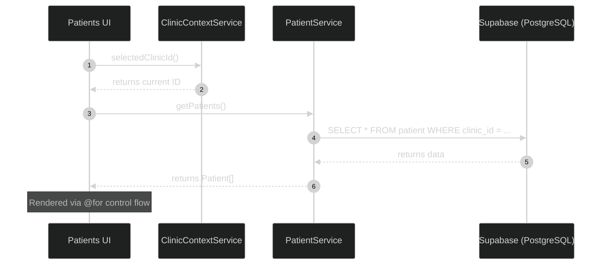
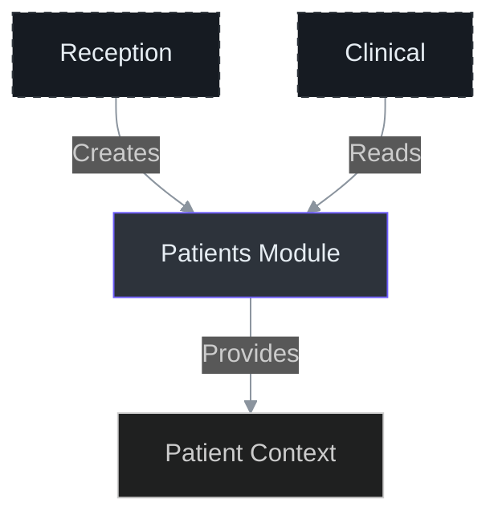

# Patients Module

The Patients module (`features/patients/`) is the central repository for patient demographic and administrative data. It serves as the foundation for clinical encounters and administrative scheduling.

## IAM Permissions

Access to patient data is governed by the `iam_bindings` system. Since patient data is highly sensitive (PII), permissions are split between basic demographic access and write capabilities.

| Permission | Description |
| :--- | :--- |
| `patients.read_demographics` | View patient list, search, and basic profiles. |
| `patients.write` | Create new patients and edit existing records. Gates the **Novo Paciente** modal. |

## Data Model

The `patient` entity stores core information. Clinical notes are stored separately in the `medical_record` table (see [Clinical Module](./clinical)).

```sql
patient {
  id            uuid PRIMARY KEY DEFAULT gen_random_uuid()
  clinic_id     uuid NOT NULL REFERENCES clinic(id)
  name          text NOT NULL
  cpf           text          -- Brazilian Tax ID
  birth_date    date
  gender        text          -- M, F, O (Outro)
  phone         text
  email         text
  address       jsonb         -- Structured address data
  created_at    timestamptz DEFAULT now()
  updated_at    timestamptz DEFAULT now()
}
```

## Components

The module follows a standalone component architecture with a focus on atomic UI elements.

- **`PatientsComponent`**: The main shell containing the patient list table, search bar, and action buttons.
- **`PatientModalComponent`**: A reactive form-driven dialog for creating and updating patient records. Built using `@angular/cdk/dialog`.

## Services & Data Flow

### PatientService API

The `PatientService` (Source: `frontend/src/app/core/services/patient.service.ts`) handles direct Supabase interactions. It strictly enforces the `clinic_id` scope retrieved from the `ClinicContextService`.

| Method | Description |
| :--- | :--- |
| `getPatients()` | Fetches all patients for the active clinic, ordered by most recently updated. |
| `getPatientById(id)` | Retrieves a single patient record scoped to the active clinic. |
| `createPatient(dto)` | Inserts a new patient record with a client-generated UUID. |
| `updatePatient(id, dto)` | Performs a scoped update and refreshes the `updated_at` timestamp. |
| `deletePatient(id)` | Removes a patient record (subject to foreign key constraints). |

### Reactive Data Flow



## Feature Isolation & Integration

As per IntraClinica architecture rules, the Patients module maintains strict FSD (Feature-Sliced Design) isolation.

- **Reception**: Creates and links patients to appointments. It imports the `Patient` model and `PatientService` but never the `PatientsComponent`.
- **Clinical**: References patient IDs for medical records. It treats the Patients module as a source of truth for demographics.
- **Inventory**: No direct dependency.



## Related Features

- [Reception Module](./reception) — Patient check-ins and scheduling.
- [Clinical Module](./clinical) — Patient medical records and history.
