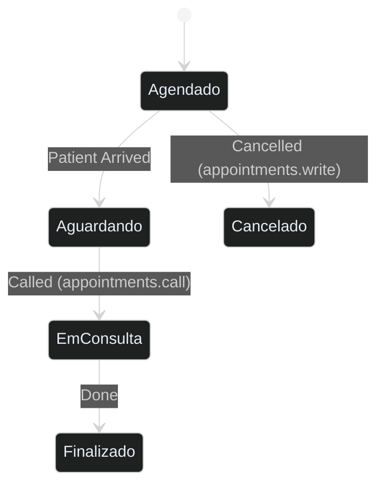
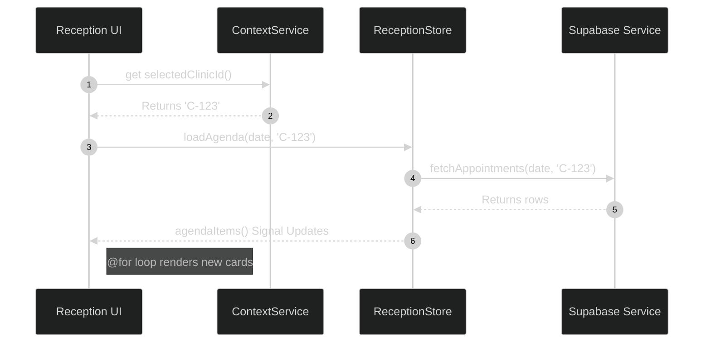

# Feature: Reception

The Reception module is the core interface for clinic administrators and front-desk staff. It handles scheduling, patient check-ins, and daily agenda views.

## 1. IAM Permissions & Security

Access to the Reception module is strictly governed by the Identity and Access Management (IAM) system. All operations are gated by specific permission keys.

### Permission Gates

| Permission Key | Description |
| :--- | :--- |
| `appointments.read` | Grants view access to the daily agenda and waitlist. |
| `appointments.write` | Required to create, edit, or cancel appointments. Gates the **Novo Agendamento** modal. |
| `appointments.call` | Allows changing an appointment status to "Chamado" and assigning a consultation room. |

### Modal Access

The **Appointment Modal** (Source: `frontend/src/app/features/reception/appointment-modal/appointment-modal.component.ts`) includes a proactive check for the `appointments.write` permission. Users lacking this key are prevented from opening the form, ensuring data integrity at the UI level.

## 2. Doctor Lookup Resolution

The Reception module requires a dynamic list of doctors for scheduling. Historically, this used a static JSONB check on the `app_user` table.

### Modern Implementation

Current implementation in `AppointmentService.getDoctors()` still references the `iam_bindings` column for backward compatibility, but the system is transitioning to a centralized permission resolution using the `roles/doctor` base package (Source: `frontend/src/app/core/models/iam.types.ts:22`).

```typescript
// Current Logic (frontend/src/app/core/services/appointment.service.ts:73)
.contains('iam_bindings', { [clinicId]: ['roles/doctor'] })
```

*Note: Future refactors will consolidate this under the centralized `iam.can()` resolver to unify role-based logic.*

## 3. Status Transitions

Appointment statuses are updated in real-time. Each transition is audited and potentially gated by the `appointments.call` permission when moving a patient from the waitlist to an active consultation.



## 4. Migration to Angular 18 Control Flow

Historically, the Reception feature relied heavily on `*ngIf`, `*ngFor`, and `*ngSwitch` directives to render the daily agenda and conditional UI states (e.g., loading spinners, empty states).

### Why the Change?

Angular 18 introduced a new, built-in control flow syntax (`@if`, `@for`, `@switch`) that is evaluated directly by the template compiler, rather than relying on structural directives that require DOM manipulation via bindings (Source: `docs/REFACTORING_PLAN.md` & `AGENTS.md:58`).

This migration improved rendering performance and simplified the template syntax.

```mermaid
%%{init: {'theme': 'dark', 'themeVariables': { 'primaryColor': '#2d333b', 'primaryBorderColor': '#6d5dfc', 'primaryTextColor': '#e6edf3', 'lineColor': '#8b949e', 'background': '#161b22' }}}%%
graph TD
    Legacy[*ngFor let item of items] --> Modern[@for (item of items; track item.id)]
    Legacy2[*ngIf="isLoading"] --> Modern2[@if (isLoading)]
    
    style Legacy fill:#161b22,stroke:#30363d,color:#e6edf3,stroke-dasharray: 5, 5
    style Legacy2 fill:#161b22,stroke:#30363d,color:#e6edf3,stroke-dasharray: 5, 5
    style Modern fill:#2d333b,stroke:#6d5dfc,color:#e6edf3
    style Modern2 fill:#2d333b,stroke:#6d5dfc,color:#e6edf3
```

## 2. Handling Empty States in Reception

During the refactoring process (PR #67), a critical bug was introduced where the `@for` loop over agenda items was accidentally removed when attempting to implement an `@empty` fallback state.

### The Fix

The `@for` block inherently supports an `@empty` clause, which renders only when the iterable is empty. This is far superior to checking `.length === 0` with an `@if`.

```html
<!-- The Correct Structure (frontend/src/app/features/reception/reception.component.ts) -->
@for (appointment of agendaItems(); track appointment.id) {
  <app-appointment-card [data]="appointment"></app-appointment-card>
} @empty {
  <div class="empty-state">
    <lucide-icon [img]="CalendarOffIcon" class="w-12 h-12 text-gray-400"></lucide-icon>
    <p>No appointments scheduled for today.</p>
  </div>
}
```

## 3. UI Styling with Tailwind & CDK

As mandated by `AGENTS.md:105`, the Reception feature avoids heavy, monolithic component libraries. 

All layouts (CSS Grid for calendars, Flexbox for lists) are constructed strictly with Tailwind CSS utility classes. Floating elements, such as the date picker popup or the appointment detail modal, are built using primitives from the `@angular/cdk` (Component Dev Kit).

## 4. Doctor Grid & Room Status

The Reception module displays a **Doctor Grid** at the top, showing all doctors with their current room assignments and online status.

### Features
- Shows doctor avatar/initials with room assignment
- Color-coded status (emerald = assigned, slate = offline)
- Real-time status based on `assignedRoom` property

### Source
`frontend/src/app/features/reception/reception.component.ts`

## 5. Agenda Calendar (Weekly View)

The Reception module includes a **Weekly Agenda Calendar** for visualizing appointments across the entire week.

### Features
- **Weekly View**: Displays 7 days (Mon-Sun) with hour rows (08:00-18:00)
- **Doctor Filter**: Filter appointments by specific doctor
- **Week Navigation**: Previous/Next week buttons + "Hoje" to reset
- **Slot Click**: Click any empty slot to create a new appointment with pre-filled date/time
- **Color-coded Appointments**: Different colors for each status (Agendado, Aguardando, Chamado, Em Atendimento, Realizado)

### Source
`frontend/src/app/features/reception/agenda-calendar.component.ts`

### Tab System
The Reception module uses a tab interface:
- **Fila Hoje**: Traditional waiting list view with patient cards
- **Agenda Semanal**: Weekly calendar view

## 6. Enhanced Appointment Modal

The appointment creation modal includes **patient search** functionality:
- Real-time search by patient name or CPF
- Dropdown results with patient selection
- Option to create new patient inline

### Source
`frontend/src/app/features/reception/appointment-modal/appointment-modal.component.ts`

## 7. Notification Center Integration

The Reception module integrates with the **Notification Center** (bell icon in header) which shows pending access requests that require approval.

### Data Flow in Reception


