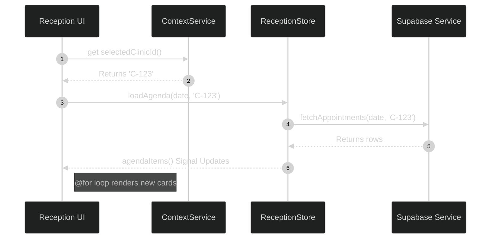

# Feature: Reception

The Reception module is the core interface for clinic administrators and front-desk staff. It handles scheduling, patient check-ins, and daily agenda views.

This document details the recent refactoring history of the Reception feature, focusing on the migration to Angular 18's new control flow and the elimination of legacy structural directives.

## 1. Migration to Angular 18 Control Flow

Historically, the Reception feature relied heavily on `*ngIf`, `*ngFor`, and `*ngSwitch` directives to render the daily agenda and conditional UI states (e.g., loading spinners, empty states).

### Why the Change?

Angular 18 introduced a new, built-in control flow syntax (`@if`, `@for`, `@switch`) that is evaluated directly by the template compiler, rather than relying on structural directives that require DOM manipulation via bindings (Source: `docs/REFACTORING_PLAN.md` & `AGENTS.md:58`).

This migration improved rendering performance and simplified the template syntax.

```mermaid
%%{init: {'theme': 'dark', 'themeVariables': { 'primaryColor': '#2d333b', 'primaryBorderColor': '#6d5dfc', 'primaryTextColor': '#e6edf3', 'lineColor': '#8b949e', 'background': '#161b22' }}}%%
graph TD
    Legacy[*ngFor let item of items] --> Modern[@for (item of items; track item.id)]
    Legacy2[*ngIf="isLoading"] --> Modern2[@if (isLoading)]
    
    style Legacy fill:#161b22,stroke:#30363d,color:#e6edf3,stroke-dasharray: 5, 5
    style Legacy2 fill:#161b22,stroke:#30363d,color:#e6edf3,stroke-dasharray: 5, 5
    style Modern fill:#2d333b,stroke:#6d5dfc,color:#e6edf3
    style Modern2 fill:#2d333b,stroke:#6d5dfc,color:#e6edf3
```

## 2. Handling Empty States in Reception

During the refactoring process (PR #67), a critical bug was introduced where the `@for` loop over agenda items was accidentally removed when attempting to implement an `@empty` fallback state.

### The Fix

The `@for` block inherently supports an `@empty` clause, which renders only when the iterable is empty. This is far superior to checking `.length === 0` with an `@if`.

```html
<!-- The Correct Structure (frontend/src/app/features/reception/reception.component.ts) -->
@for (appointment of agendaItems(); track appointment.id) {
  <app-appointment-card [data]="appointment"></app-appointment-card>
} @empty {
  <div class="empty-state">
    <lucide-icon [img]="CalendarOffIcon" class="w-12 h-12 text-gray-400"></lucide-icon>
    <p>No appointments scheduled for today.</p>
  </div>
}
```

## 3. UI Styling with Tailwind & CDK

As mandated by `AGENTS.md:105`, the Reception feature avoids heavy, monolithic component libraries. 

All layouts (CSS Grid for calendars, Flexbox for lists) are constructed strictly with Tailwind CSS utility classes. Floating elements, such as the date picker popup or the appointment detail modal, are built using primitives from the `@angular/cdk` (Component Dev Kit).

### Data Flow in Reception


