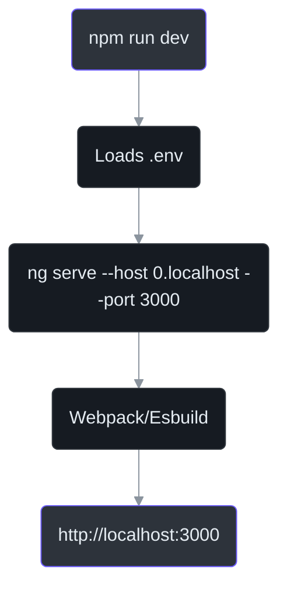
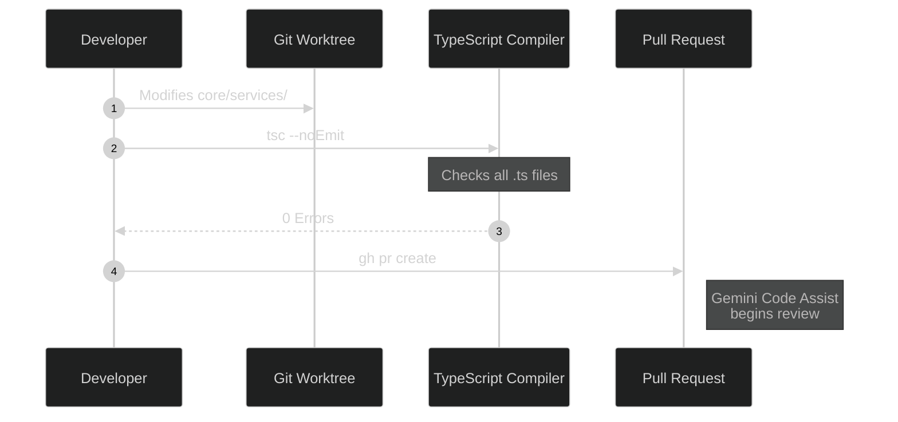

# Local Development & Build

IntraClinica is a strict Angular 18 application integrating with a local or remote Supabase instance.

This guide covers the fundamental commands to start the development server, run type checks, and build the application. As dictated by `AGENTS.md:12`, all commands **must** be executed within the `frontend/` directory.

## 1. Starting the Dev Server

The default method to run the project locally uses the Angular CLI, wrapped in an npm script for convenience.

```bash
cd frontend
npm run dev
```

### Why not simply `ng serve`?
Running `npm run dev` ensures that environment variables (like Supabase API keys) and Node flags configured in `package.json` are properly passed to the build process.



## 2. Type Checking (The Golden Rule)

As mandated by `AGENTS.md:19`, committing code with TypeScript errors is strictly prohibited. You must run the TypeScript compiler in dry-run mode before creating a Pull Request.

```bash
cd frontend
./node_modules/.bin/tsc --noEmit
```

### Why `tsc --noEmit`?
Angular's `ng build` sometimes obfuscates deeper type errors, or ignores them depending on `angular.json` strictness settings. 

Running `tsc --noEmit` directly invokes the compiler using `tsconfig.app.json` without outputting JavaScript files. If it returns 0 errors, the codebase is structurally sound.



## 3. Production Build

To test production optimizations (tree-shaking, minification, and AOT compilation) locally, run the build command.

```bash
cd frontend
npm run build
```

The output will be placed in the `frontend/dist/` directory.

### Why test production builds?
Certain features, particularly the Lazy Loading of the LocalAiService (WebLLM/WebGPU, see `AGENTS.md:113`), behave differently when bundled. Testing the production build ensures that chunks are correctly separated and that the initial bundle size remains small.
