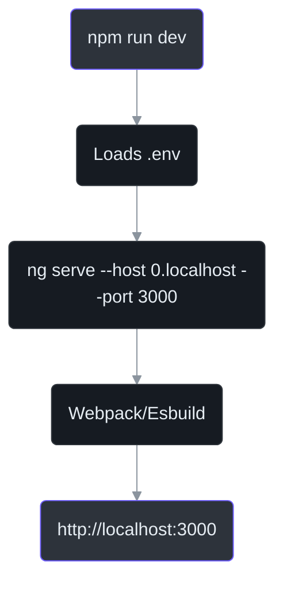
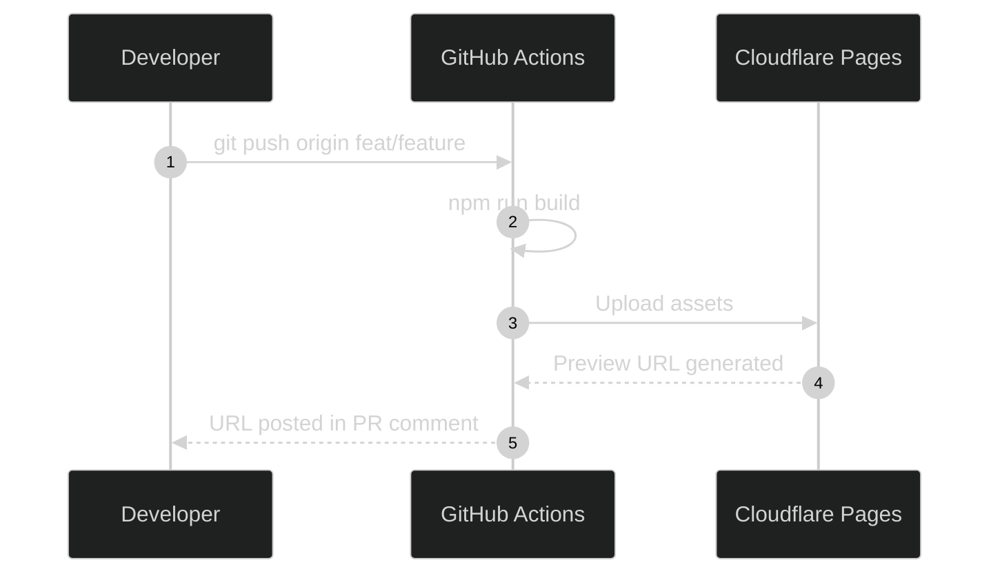

# Local Development & Build

IntraClinica is a strict Angular 18 application integrating with a local or remote Supabase instance.

This guide covers the fundamental commands to start the development server, run type checks, and build the application. As dictated by `AGENTS.md`, all frontend operations **must** be executed within the `frontend/` directory.

## 1. Directory Structure

The project root for the application is `frontend/`. Any legacy references to `frontend-v2/` should be ignored as that version has been archived.

```text
/ (Project Root)
├── frontend/             <-- Active Angular 18 project
├── wiki-site/            <-- Documentation portal
└── supabase/             <-- Supabase migrations and functions
```

## 2. Frontend Commands

All commands below must be run from the `frontend/` directory.

### Starting the Dev Server
Runs `ng serve` on `http://localhost:3000`.

```bash
cd frontend
npm run dev
```

### Type Checking (MANDATORY)
As mandated by `AGENTS.md`, committing code with TypeScript errors is strictly prohibited. You must run the TypeScript compiler in dry-run mode before creating a Pull Request.

```bash
cd frontend
./node_modules/.bin/tsc --noEmit
```

### Running Tests
IntraClinica uses **Vitest** for unit testing. You can run all tests or target specific files.

```bash
cd frontend
# Run all unit tests
npm run test

# Run a single test file
npx vitest run path/to/file.spec.ts
```

### Production Build
To test production optimizations (tree-shaking, minification, and AOT compilation) locally.

```bash
cd frontend
npm run build
```

The output will be placed in the `frontend/dist/` directory.



## 3. Deployment & Previews

IntraClinica uses Cloudflare Pages for hosting. 

### Automated Previews
Every Pull Request automatically triggers a **Cloudflare Pages Preview** deployment via GitHub Actions.
1. Push your branch to GitHub.
2. A GitHub Action starts the build process.
3. Once finished, a comment is posted to the PR with a unique preview URL.



## 4. Supabase Local Development

If you need to modify the database schema or Edge Functions:

1. **Start Supabase locally**: Ensure Docker is running and execute `supabase start`.
2. **Link Project**: Use `supabase link --project-ref <your-project-id>`.
3. **Database Changes**: All schema changes must be handled via migrations in the `supabase/migrations/` directory. Never modify the production database directly.

For more details on IAM and multi-tenant security, see the [IAM Security Model](/core-architecture/iam-security-model) and [Multi-Tenant Security](/core-architecture/multi-tenant-security).
