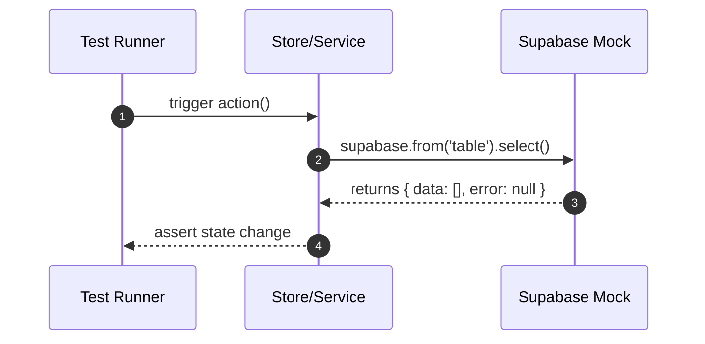
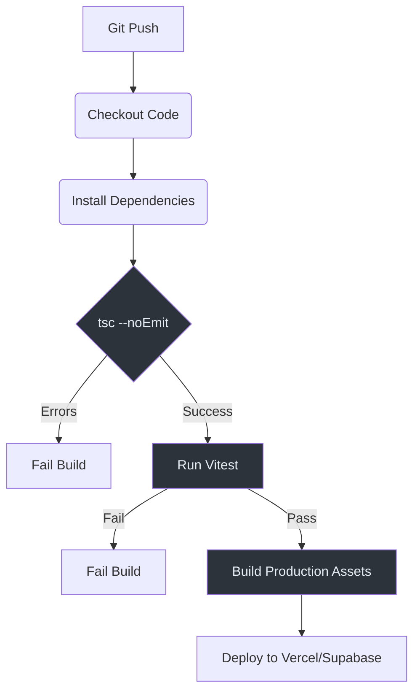

# Testing Workflow

IntraClinica uses a modern, signal-based testing stack centered on **Vitest** and **Playwright**. All frontend operations must be executed inside the `/frontend` directory.

## Type Safety Mandate

The codebase enforces a zero-tolerance policy for TypeScript errors. Every PR is audited by GitHub Actions, and the build will fail if any type mismatches exist.

```bash
# Inside /frontend
./node_modules/.bin/tsc --noEmit
```

::: danger Strict Error Policy
The `tsc --noEmit` command must report **exactly 0 errors** before any code is committed. Supabase-generated types and strict Angular generics surface critical errors that `ng build` might ignore.
:::

## Unit Testing: Vitest

We use **Vitest** for fast, reactive unit testing. Legacy Karma configurations have been removed from the repository.

### Commands

| Action | Command |
| :--- | :--- |
| **Run all tests** | `npm run test` |
| **Single file** | `npm run test -- <filename>` |
| **Specific path** | `npx vitest run path/to/file.spec.ts` |
| **Watch mode** | `npx vitest` |
| **Coverage report** | `npx vitest run --coverage` |

### Mocking Patterns

Vitest handles Supabase client mocking through `vi.mock()` in `src/test-setup.ts`. This ensures unit tests never perform real network requests to the database (file: `frontend/src/test-setup.ts`).



## E2E Testing: Playwright

**Playwright** is used for UI audits and end-to-end flows. 

::: info Future Work
The Playwright suite is currently under development. While the configuration exists in `playwright.config.ts`, full coverage for complex multi-tenant flows is not yet fully implemented.
:::

### Basic Commands

```bash
npx playwright test              # run all E2E specs
npx playwright test --ui          # interactive UI mode
npx playwright test reception     # run specific feature tests
```

## CI/CD Pipeline

The project uses GitHub Actions for continuous integration. Every push triggers a verification flow that ensures the application is deploy-ready.



## Test File Conventions

- **Unit tests**: `*.spec.ts` located in the same folder as the target component or service.
- **E2E specs**: `e2e/*.spec.ts` for cross-feature flows.
- **Integration tests**: `src/app/core/store/*.spec.ts` for verifying complex Signal store logic.

## Related Documentation

- [Local Development](./local-development) — dev server setup
- [Core Architecture: Multi-Tenant Security](../core-architecture/multi-tenant-security) — filtering by clinicId in tests
