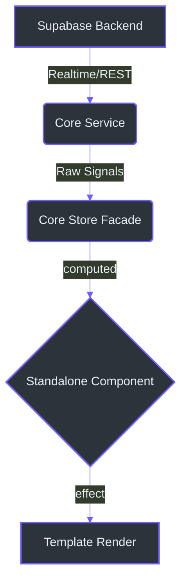
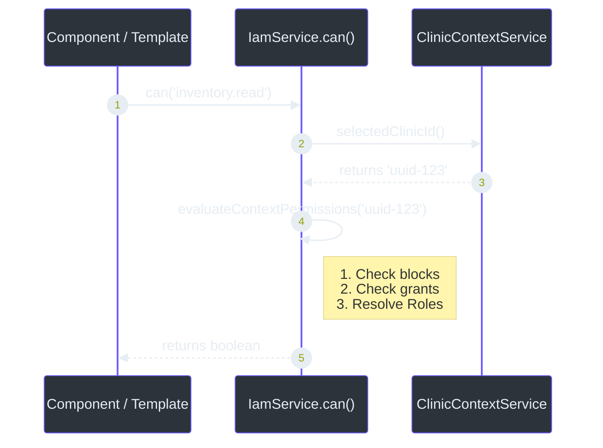
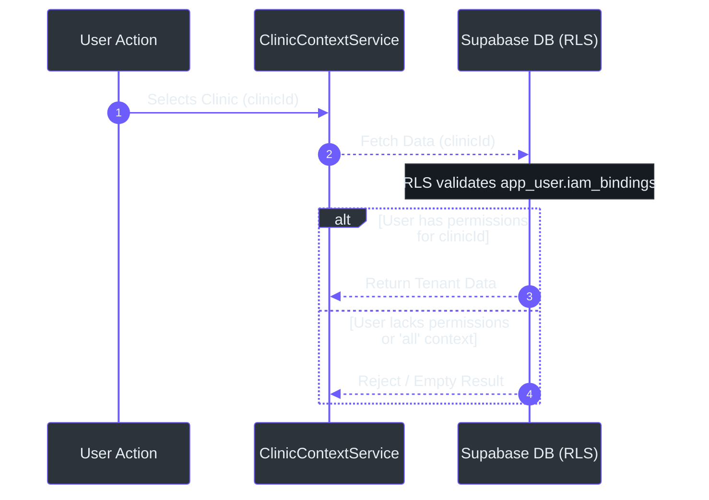

# Principal-Level Architecture Guide

Welcome to the **"Alma" (Intel Core)** of IntraClinica. This guide details our foundational engineering decisions, focusing on data sovereignty, transactional integrity, and our integration with the Axio memory architecture.

As outlined in [`docs/01_INTEL_CORE.md`](https://github.com/bbanho/intraclinica-supabase/blob/main/docs/01_INTEL_CORE.md) and [`AGENTS.md`](https://github.com/bbanho/intraclinica-supabase/blob/main/AGENTS.md), our system is designed for bank-level security with zero cross-tenant data leaks and extreme frontend reactivity.

## 1. Modern Angular 18+ Patterns

IntraClinica is built on the latest Angular 18+ features, focusing on developer ergonomics and performance.

### Essential Patterns
- **Standalone Components:** All components must be `standalone: true`. No `NgModule` definitions (frontend/src/app/core/models/iam.types.ts).
- **Control Flow:** Strictly use the new `@if`, `@for`, and `@switch` syntax. Legacy directives like `*ngIf` are forbidden (frontend/src/app/layout/main-layout.component.ts:55).
- **Dependency Injection:** Always use the `inject()` function for services and stores. Avoid constructor injection to maintain consistency with our functional-style patterns (frontend/src/app/core/services/iam.service.ts:11).

## 2. 100% Signal-Based Reactivity

IntraClinica completely eschews legacy state management libraries like NgRx in favor of Angular's native Signals. The entire application flow is reactive.

### The Reactivity Anti-Pattern
As mandated in [`AGENTS.md`](https://github.com/bbanho/intraclinica-supabase/blob/main/AGENTS.md), you must **never** assign a signal's static value to a property during initialization. Doing so breaks reactivity.

**BAD:**
```typescript
ngOnInit() {
  this.items = this.store.items(); // Breaks reactivity!
}
```

**GOOD:**
Instead, expose the signal directly to the template or derive new state via `computed()`.



*Why?* This approach guarantees that our UI is completely synchronized with the current clinic context and backend state without complex subscription management.

## 3. Atomic Operations & Data Sovereignty

To improve query performance and code simplicity, the legacy `actor` abstraction table has been flattened and entirely removed (per [`AGENTS.md`](https://github.com/bbanho/intraclinica-supabase/blob/main/AGENTS.md)). 

### Data Sovereignty
Entities like `patient` and `app_user` now contain their own `name` columns directly. You will no longer traverse deeply nested structures (e.g., `patient.actor.name`).

### Transactional Integrity (The "Alma")
Operations that mutate multiple tables simultaneously (e.g., creating a product and its initial stock) **MUST** be handled by PostgreSQL RPC functions (e.g., `create_product_with_stock`). 

*Why?* Executing multiple `await this.supabase.insert()` operations in an Angular service is not atomic and can lead to orphaned records if a network failure occurs midway. Pushing this to the database layer guarantees strict transactional integrity.

## 4. Multi-Tenant Context & Security

IntraClinica is a true multi-tenant SaaS application. Every record is intrinsically tied to a `clinic_id`, and data isolation is enforced at the database level via Row Level Security (RLS).

### Clinic Context Logic
Every feature component and service must actively read the current clinic context via `ClinicContextService.selectedClinicId()` (frontend/src/app/core/services/clinic-context.service.ts:8).

**Validation Rule:**
If the feature is localized (e.g., Inventory, Reception, Clinical) and `clinicId === 'all'` or `null`, the component must immediately **abort data fetching** or display an empty state. Silently loading "all" records in a localized context is a security risk and is blocked by RLS.

### IAM Permission Workflow

User permissions are no longer determined by a static `type` column. Instead, we use the `app_user.iam_bindings` JSONB column. 

**Developers MUST use `IamService.can(permissionKey)`** for all UI visibility and action guards. Hardcoded role checks (e.g., `role === 'ADMIN'`) are strictly forbidden.

```typescript
// frontend/src/app/layout/main-layout.component.ts
@if (iam.can('clinics.manage')) {
  <button (click)="openClinicSettings()">Settings</button>
}
```

#### JSONB Bindings Mechanism
To query if a user is a doctor within a specific clinic directly in the database, you must use JSONB containment (frontend/src/app/core/services/iam.service.ts:70):
```typescript
.contains('iam_bindings', { [clinicId]: ['roles/doctor'] })
```



### Fail-Loud Philosophy
We do not use silent fallbacks. If a developer attempts to query data without a valid `clinic_id` or without the necessary IAM grants, the database will return an empty set or an error. The frontend must handle these states explicitly and provide clear feedback to the user rather than failing silently.



*Why?* This JSONB-based IAM approach allows a single user to hold different roles across multiple clinics seamlessly, scaling perfectly with our multi-tenant SaaS architecture.
