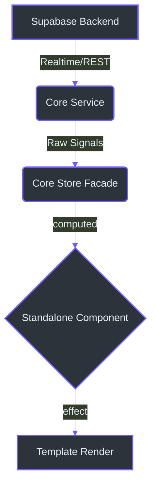
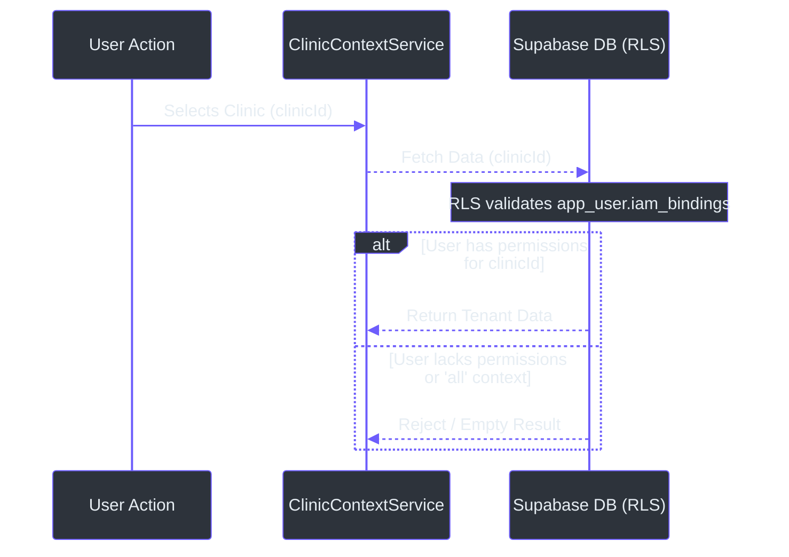

# Principal-Level Architecture Guide

Welcome to the **"Alma" (Intel Core)** of IntraClinica. This guide details our foundational engineering decisions, focusing on data sovereignty, transactional integrity, and our integration with the Axio memory architecture.

As outlined in [`docs/01_INTEL_CORE.md`](../../docs/01_INTEL_CORE.md) and [`AGENTS.md`](../../AGENTS.md), our system is designed for bank-level security with zero cross-tenant data leaks and extreme frontend reactivity.

## 1. 100% Signal-Based Reactivity

IntraClinica completely eschews legacy state management libraries like NgRx in favor of Angular's native Signals. The entire application flow is reactive.

### The Reactivity Anti-Pattern
As mandated in [`AGENTS.md`](../../AGENTS.md), you must **never** assign a signal's static value to a property during initialization. Doing so breaks reactivity.

**BAD:**
```typescript
ngOnInit() {
  this.items = this.store.items(); // Breaks reactivity!
}
```

**GOOD:**
Instead, expose the signal directly to the template or derive new state via `computed()`.



*Why?* This approach guarantees that our UI is completely synchronized with the current clinic context and backend state without complex subscription management.

## 2. Flattened Database Schema & Atomic Operations

To improve query performance and code simplicity, the legacy `actor` abstraction table has been flattened and entirely removed (per [`AGENTS.md`](../../AGENTS.md)). 

### Data Sovereignty
Entities like `patient` and `app_user` now contain their own `name` columns directly. You will no longer traverse deeply nested structures (e.g., `patient.actor.name`).

### Transactional Integrity (The "Alma")
Operations that mutate multiple tables simultaneously (e.g., creating a product and its initial stock) **MUST** be handled by PostgreSQL RPC functions (e.g., `create_product_with_stock`). 

*Why?* Executing multiple `await this.supabase.insert()` operations in an Angular service is not atomic and can lead to orphaned records if a network failure occurs midway. Pushing this to the database layer guarantees strict transactional integrity.

## 3. Supabase RLS & Multi-Tenant Context

IntraClinica is a true multi-tenant SaaS application. Every record is intrinsically tied to a `clinic_id`, and data isolation is enforced at the database level via Row Level Security (RLS).

### Context Awareness
Every feature component and service must actively read the current clinic context.
```typescript
const clinicId = this.context.selectedClinicId();
```
If the feature is localized (e.g., Inventory, Reception) and `clinicId === 'all'` or `null`, the component must immediately abort data fetching or display an empty state.

### IAM Bindings
User permissions are no longer determined by a static `type` column. Instead, we use the `app_user.iam_bindings` JSONB column.

To query if a user is a doctor within a specific clinic, you must use JSONB containment:
```typescript
.contains('iam_bindings', { [clinicId]: ['DOCTOR'] })
```



*Why?* This JSONB-based IAM approach allows a single user to hold different roles across multiple clinics seamlessly, scaling perfectly with our multi-tenant SaaS architecture.
