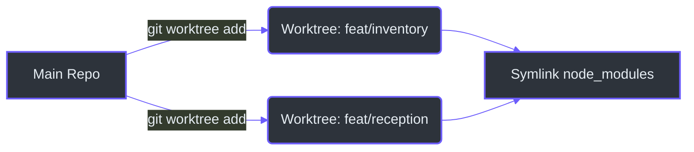
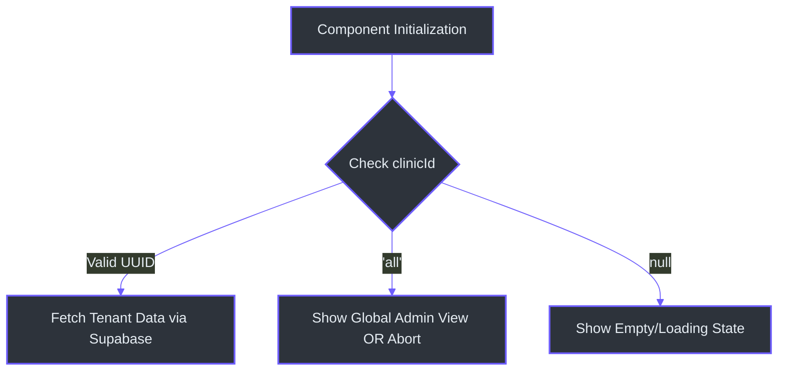

# Zero-to-Hero Contributor Walkthrough

Welcome to the IntraClinica development team! This guide will take you from setting up your environment to shipping your first feature following our strict, modern architecture standards. 

All operations described here apply to the **`/frontend`** directory. The `frontend-legacy` folder should be entirely ignored, as outlined in [`AGENTS.md`](https://github.com/bbanho/intraclinica-supabase/blob/main/AGENTS.md).

## 1. Local Development Setup

To ensure code quality and consistency, we have strict run commands and checks. 

### Commands You Need to Know
- **Start Dev Server:** `npm run dev` (Runs on `http://localhost:3000`)
- **Build Production:** `npm run build`
- **Unit Tests:** `npm run test` (Using Vitest)
- **Strict Type Checking:** `./node_modules/.bin/tsc --noEmit`

> **CRITICAL:** Before opening any Pull Request, you must run `tsc --noEmit` inside the `frontend/` folder and achieve exactly 0 errors.

## 2. Parallel Development via Git Worktrees

If you are an agent or a developer working on multiple features simultaneously, you must use Git Worktrees to prevent branch contamination.



As defined in [`AGENTS.md`](https://github.com/bbanho/intraclinica-supabase/blob/main/AGENTS.md), worktrees isolate your feature code (`features/reception/`, `features/inventory/`) allowing independent testing and atomic commits. We symlink `node_modules` to save disk space and installation time.

## 3. Building a Modern Angular Feature

IntraClinica uses the cutting edge of Angular 18+. When building new UI elements, you must follow these rules:

1.  **Standalone Components:** Every component must be `standalone: true`. The `NgModule` concept is dead in this repository.
2.  **Modern Control Flow:** Strictly use `@if`, `@for`, `@empty`, and `@switch`. Legacy directives like `*ngIf` and `*ngFor` are banned.
3.  **Dependency Injection:** Always use `inject()` for pulling in services and stores instead of bloated constructor arguments.
4.  **Signals Everywhere:** The application is 100% Signal-based. Use `signal()`, `computed()`, and `effect()`. Avoid assigning signal values to static properties in constructors.
5.  **Styling & UI:** Use **Tailwind CSS** utility classes exclusively. Build dynamic elements using `@angular/cdk`. We rely on `lucide-angular` for icons.

## 4. Identity & Access Management (IAM) Workflow

IntraClinica uses a granular IAM system based on GCP-style permissions. Understanding how security initializes is vital for any contributor.

### The Lifecycle of Permissions
1.  **Auth Hook:** The `AuthService.currentUser()` signal tracks the Supabase session (frontend/src/app/core/services/auth.service.ts:12).
2.  **IAM Initialization:** The `IamService` uses an `effect()` to watch for auth changes. When a user logs in, it downloads roles, permissions, and the user's specific `iam_bindings` matrix into a local Signal cache (frontend/src/app/core/services/iam.service.ts:28).
3.  **Local Evaluation:** Permission checks happen in milliseconds locally. The engine evaluates:
    *   **Blocks:** Absolute denials for a specific key.
    *   **Grants:** Explicit permission concessions.
    *   **Roles:** Permissions inherited from assigned role packages.

### Feature Gating
Never hardcode roles (e.g., `if(user.role === 'ADMIN')`). Always use the permission-based gate:

```typescript
private iam = inject(IamService);
public canEdit = computed(() => this.iam.can('inventory.product.edit'));
```

## 5. Context Awareness & Multi-Tenancy

Every time you build a feature, you must ask yourself: *"What clinic context is the user currently viewing?"*

IntraClinica is a multi-tenant SaaS. Our Row Level Security (RLS) policies are tied strictly to the `clinicId` and the `app_user.iam_bindings` JSONB column.

### Handling the Clinic Context
Always fetch the active clinic ID via `ClinicContextService`:

```typescript
private context = inject(ClinicContextService);
const clinicId = this.context.selectedClinicId();
```



The `'all'` context represents a `SUPER_ADMIN` viewing the global SaaS landscape. If your feature is highly localized (like an Inventory tracker or Clinical record), displaying global data makes no sense and could lead to accidental cross-tenant data mutation. You must defensively handle `'all'` and `null` to ensure data sovereignty.
